---
## Front matter
title: "Лабораторная работа №4"
subtitle: "Основы интерфейса взаимодействия пользователя с системой Unix на уровне командной строки"
author: "Тулеуов Мади"

## Generic otions
lang: ru-RU
toc-title: "Содержание"

## Bibliography
bibliography: bib/cite.bib
csl: pandoc/csl/gost-r-7-0-5-2008-numeric.csl

## Pdf output format
toc: true # Table of contents
toc-depth: 2
lof: true # List of figures
lot: true # List of tables
fontsize: 12pt
linestretch: 1.5
papersize: a4
documentclass: scrreprt
## I18n polyglossia
polyglossia-lang:
  name: russian
  options:
	- spelling=modern
	- babelshorthands=true
polyglossia-otherlangs:
  name: english
## I18n babel
babel-lang: russian
babel-otherlangs: english
## Fonts
mainfont: PT Serif
romanfont: PT Serif
sansfont: PT Sans
monofont: PT Mono
mainfontoptions: Ligatures=TeX
romanfontoptions: Ligatures=TeX
sansfontoptions: Ligatures=TeX,Scale=MatchLowercase
monofontoptions: Scale=MatchLowercase,Scale=0.9
## Biblatex
biblatex: true
biblio-style: "gost-numeric"
biblatexoptions:
  - parentracker=true
  - backend=biber
  - hyperref=auto
  - language=auto
  - autolang=other*
  - citestyle=gost-numeric
## Pandoc-crossref LaTeX customization
figureTitle: "Рис."
tableTitle: "Таблица"
listingTitle: "Листинг"
lofTitle: "Список иллюстраций"
lotTitle: "Список таблиц"
lolTitle: "Листинги"
## Misc options
indent: true
header-includes:
  - \usepackage{indentfirst}
  - \usepackage{float} # keep figures where there are in the text
  - \floatplacement{figure}{H} # keep figures where there are in the text
---

# Цель работы

Приобретение практических навыков взаимодействия пользователя с системой посредством командной строки.

# Задания

1. Определите полное имя вашего домашнего каталога. Далее относительно этого каталога будут выполняться последующие упражнения.
2. Выполните следующие действия:
    1. Перейдите в каталог /tmp.
    2. Выведите на экран содержимое каталога /tmp. Для этого используйте команду ls
    3. различными опциями. Поясните разницу в выводимой на экран информации.
    3. Определите, есть ли в каталоге /var/spool подкаталог с именем cron?
    4. Перейдите в Ваш домашний каталог и выведите на экран его содержимое. Определите,кто является владельцем файлов и подкаталогов?
3. Выполните следующие действия:
    1. В домашнем каталоге создайте новый каталог с именем newdir.
    2. В каталоге ~/newdir создайте новый каталог с именем morefun.
    3. В домашнем каталоге создайте одной командой три новых каталога с именами
    letters, memos, misk. Затем удалите эти каталоги одной командой.
    4. Попробуйте удалить ранее созданный каталог ~/newdir командой rm. Проверьте,
    был ли каталог удалён.
    5. Удалите каталог ~/newdir/morefun из домашнего каталога. Проверьте, был ли
каталог удалён.
4. С помощью команды man определите, какую опцию команды ls нужно использовать для просмотра содержимое не только указанного каталога, но и подкаталогов,входящих в него.
5. С помощью команды man определите набор опций команды ls, позволяющий отсортировать по времени последнего изменения выводимый список содержимого каталога
с развёрнутым описанием файлов.
6. Используйте команду man для просмотра описания следующих команд: cd, pwd, mkdir,
rmdir, rm. Поясните основные опции этих команд.
7. Используя информацию, полученную при помощи команды history, выполните модификацию и исполнение нескольких команд из буфера команд.

# Ход работы

**1.** Я открыл терминал, ввел команду *cd*, чтобы переместиться в домашний каталог и ввёл команду *pwd*, чтобы просмотреть полное имя каталога.(рис. [-@fig:001])

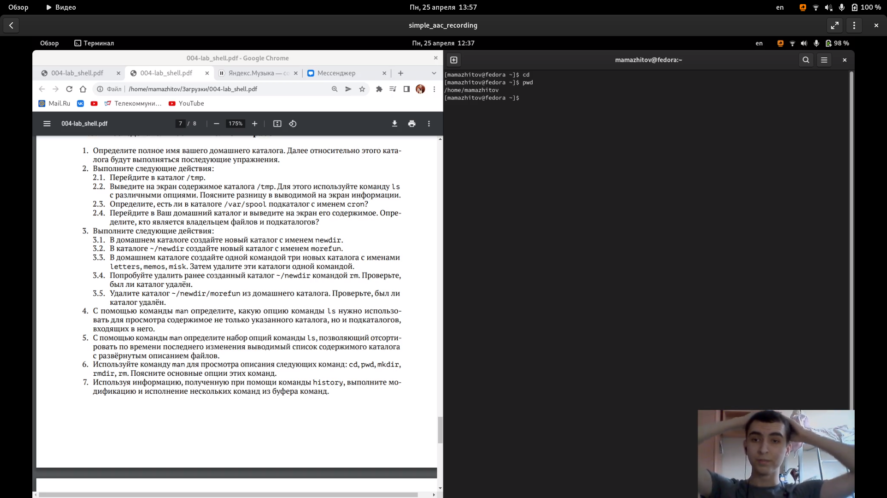{ #fig:001 width=70% }

**2.** Далее я перешел в каталог */tmp*, воспользовался командой *ls* с опциями и без них(на скринкасте слышно, как я пояснил разницу между опциями).(рис. [-@fig:002])

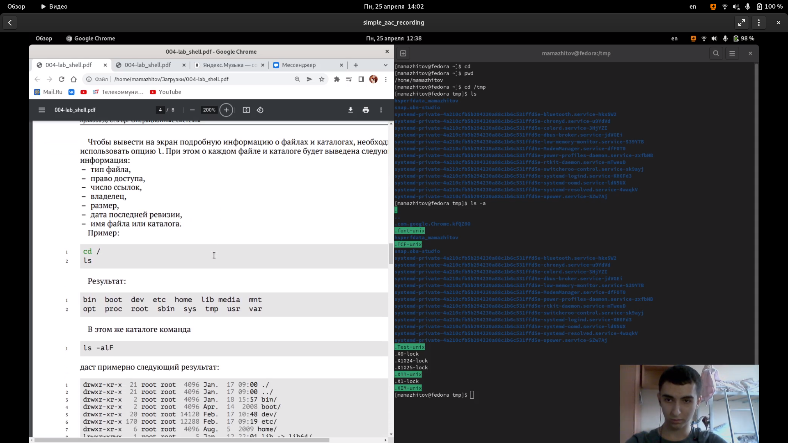{ #fig:002 width=70% }

**3.** Затем я перешел в каталог */var/spool* и с помощью команды *ls* проверил есть ли в данном каталоге подкаталог с именем *cron*(его там не было).(рис. [-@fig:003])

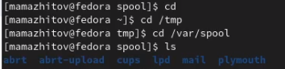{ #fig:003 width=70% }

**4.** Я перешел в домашний каталог и вывел с помощью *ls -l* его содержимое вместе с дополнительными данными.(рис. [-@fig:004])

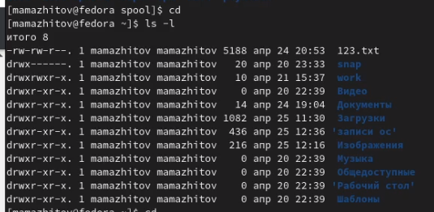{ #fig:004 width=70% }

**5.** Создал в домашнем каталоге новый каталог *newdir*, а в нем уже создал другой каталог *morefun*.(рис. [-@fig:005])

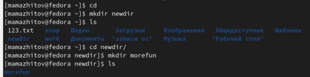{ #fig:005 width=70% }

**6.** В домашнем каталоге с помощью одной команды *mkdir letters memos misk* создал три каталога с соетветствующими именами, а затем их удалил.(рис. [-@fig:006])

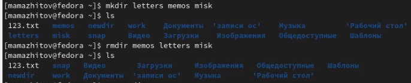{ #fig:006 width=70% }

**7.** Попробовал с помощью команды *rm* удалить каталог *newdir*, но у меня это не вышло. Затем с помощью той же команды попробовал удалить *morefun*. Это тоже у меня получилось, однако мне удалось удалить *morefun* с помощью команды *rmdir*.(рис. [-@fig:007])

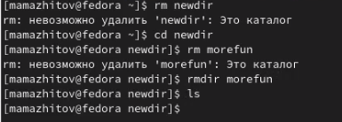{ #fig:007 width=70% }

**8.** С помощью команды *man ls* вывел справку по команде *ls*. В ней я нашёл опцию *-R*, которая позволяет просмотреть содержимое выводимых каталогов.(рис. [-@fig:008])

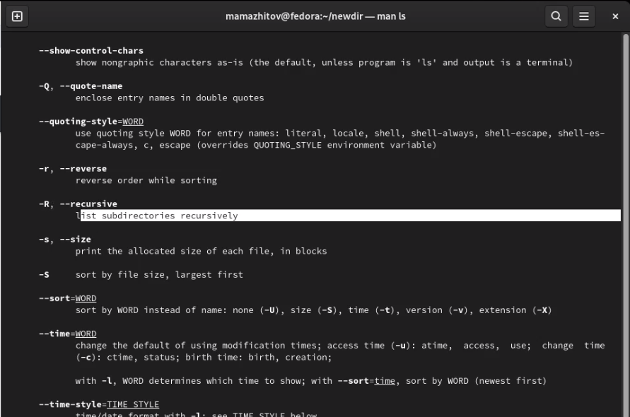{ #fig:008 width=70% }

Далее я посмотрел вывод этой команды.(рис. [-@fig:009])

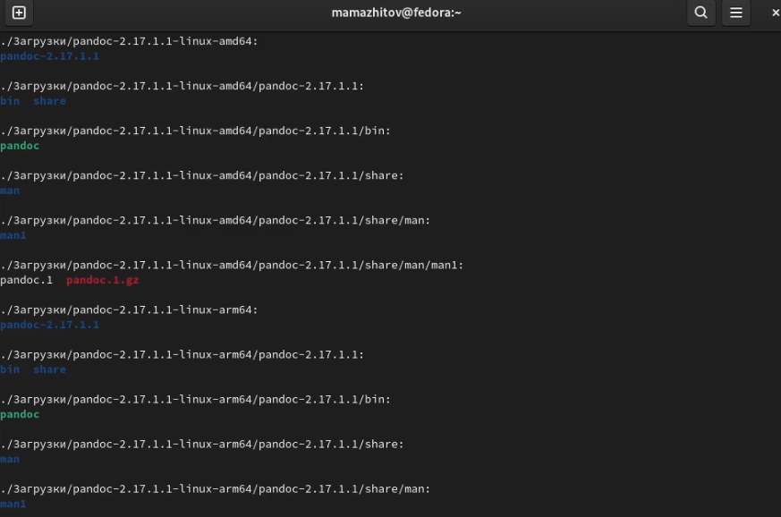{ #fig:009 width=70% }

**9.** Опять вывел справку по команде *ls* и нашел опцию *-с*, которая выводит отсортированный по времени последнего изменения выводимый список содержимого каталога
с развёрнутым описанием файлов.(рис. [-@fig:010])

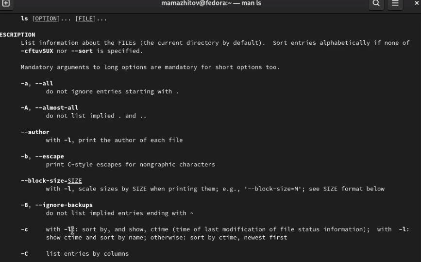{ #fig:0010 width=70% }

Проверил работы команды.(рис. [-@fig:011])

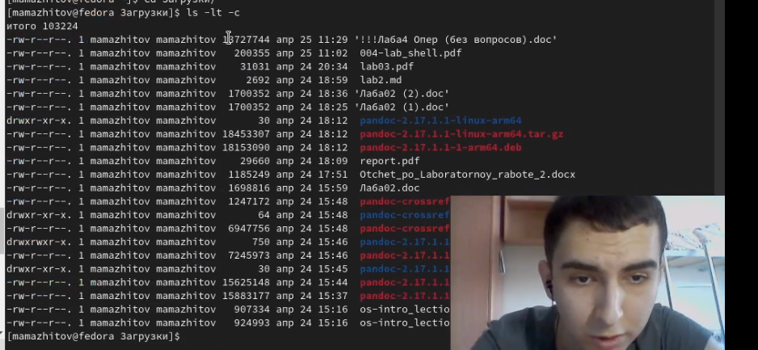{ #fig:011 width=70% }

**10.** Используя команду *man* для просмотра описания следующих команд: *cd*, *pwd*, *mkdir*, *rmdir*, *rm*. На скринкасте поянил основные опции данных команд.(рис. [-@fig:012])

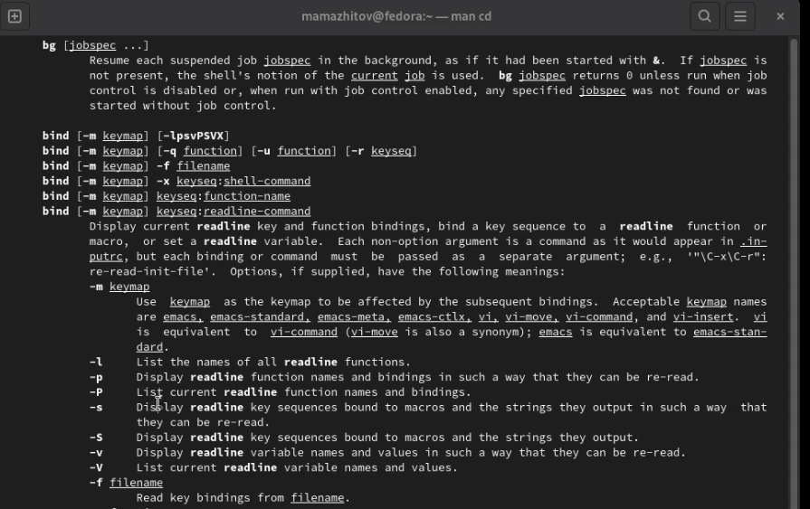{ #fig:012 width=70% }

- -P - позволяет следовать по символическим ссылкам перед тем, как будут обработаны все переходы "..";
- -L - переходит по символическим ссылкам только после того, как были обработаны "..";
- -e - если папку, в которую нужно перейти не удалось найти - выдает ошибку
(рис. [-@fig:013])

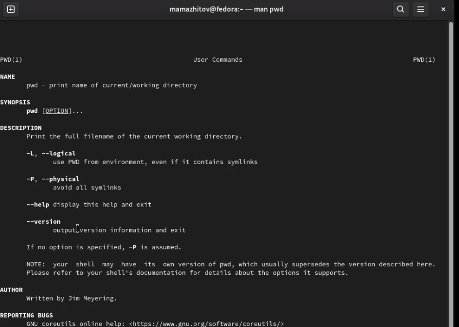{ #fig:013 width=70% }

- -L, --logical - брать директорию из переменной окружения, даже если она содержит символические ссылки;
- -P - отбрасывать все символические ссылки;
- --help - отобразить справку по утилите;
- --version - отобразить версию утилиты.
(рис. [-@fig:014])

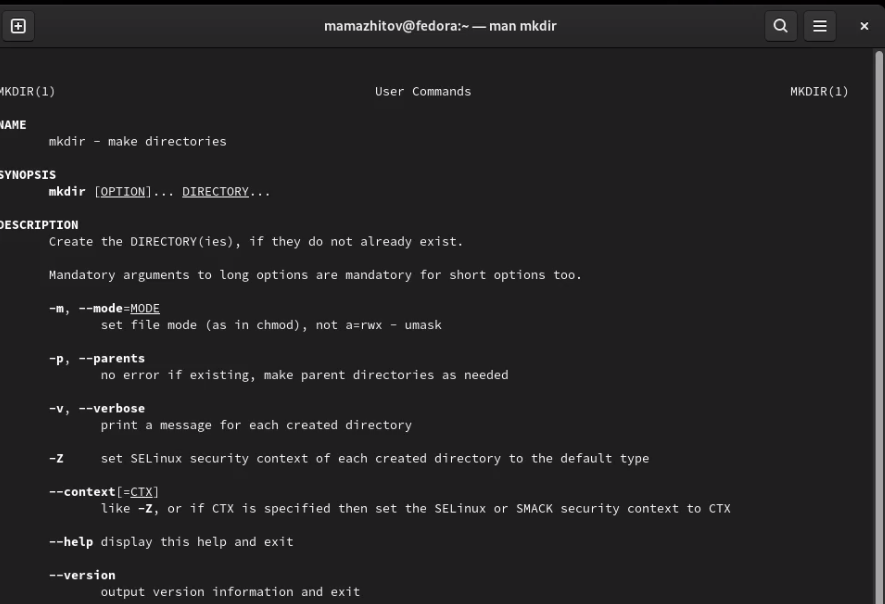{ #fig:014 width=70% }

- -m (--mode=режим) - назначить режим доступа (права). По умолчанию mod принимает значение 0777, что обеспечивает неограниченные права.
- -p (--parents) - не показывать ошибки, а также их игнорировать.
- -z  (--context=CTX ) принимает контекст SELinux для каталога по умолчанию.
- -v (--verbose) - выводить сообщение о каждом новым каталоге.
- --help - вывести справочную информацию.
- --version - выводит информацию о текущей версии утилиты.
(рис. [-@fig:015])

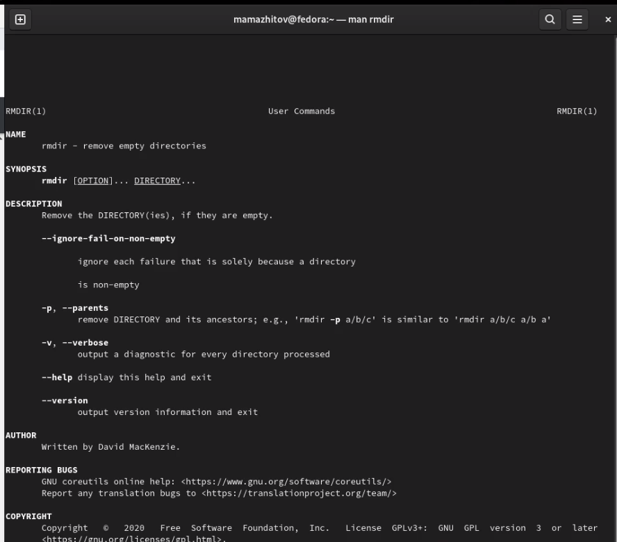{ #fig:015 width=70% }

- --ignore-fail-on-non-empty
> игнорирование наличие файлов в каталоге.
- -p, --parents
> Позволяет удалить каталог и вышележащие каталоги, оказавшиеся пустыми.
- -v, --verbose
> вывод выполнения всех действий.
- --help
> вывод инструкции.
- --version
> вывод информации о версии.
(рис. [-@fig:016])

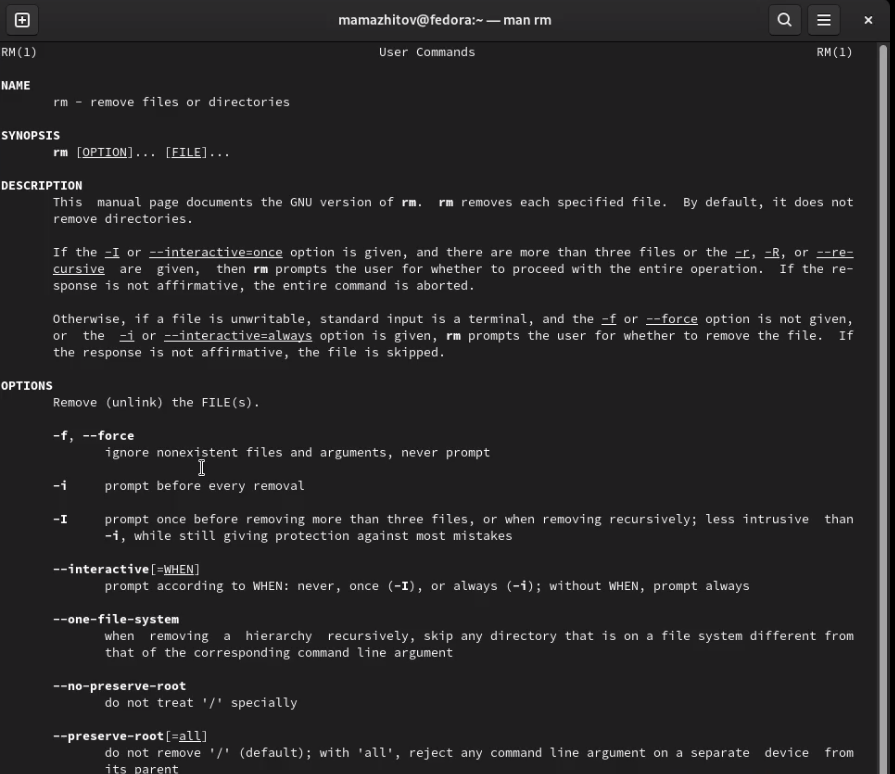{ #fig:016 width=70% }

- -f или --force
> Игнорировать несуществующие файлы и аргументы. Никогда не выдавать запросы на подтверждение удаления.

- -i
> Выводить запрос на подтверждение удаления каждого файла.

- -I
> Выдать один запрос на подтверждение удаления всех файлов, если удаляется больше трех файлов или используется рекурсивное удаление. Опция применяется, как более «щадящая» версия опции -i

- --one-file-system
> Во время рекурсивного удаления пропускать директории, которые находятся на других файловых системах.

- -r или -R или --recursive
> Удаление директорий и их содержимого. Рекурсивное удаление.

**11.** С помощью команды *history* вывел все ранее введенные команды, модифировал несколько из них и выполнил.
(рис. [-@fig:017,-@fig:018])

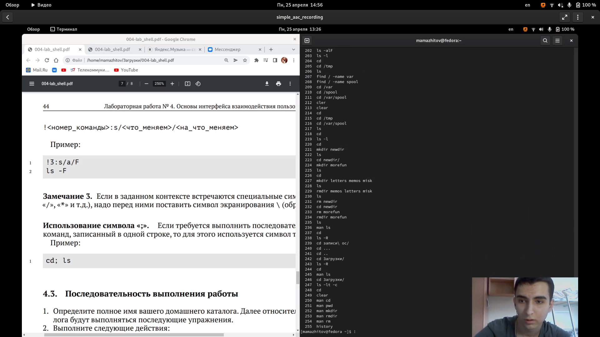{ #fig:017 width=70% }

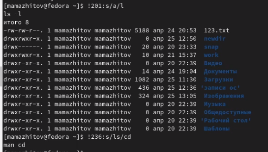{ #fig:018 width=70% }

# Вывод

Мы приобрели практические навыки взаимодействия пользователя с системой посредством командной строки.

# Контрольные вопросы.

1. Что такое командная строка?
- В операционной системе типа Linux взаимодействие пользователя с системой обычно
осуществляется с помощью командной строки.
2. При помощи какой команды можно определить абсолютный путь текущего каталога?
Приведите пример.
- Для определения абсолютного пути к текущему каталогу используется
команда pwd (print working directory). Например, при вводе данной команды в домашнем каталоге, он выведет */home/mamazhitov*.
3. При помощи какой команды и каких опций можно определить только тип файлов
и их имена в текущем каталоге? Приведите примеры.
- С помощью команды *ls* и опция F можно получить информацию о типах файлов (каталог, исполняемый файл, ссылка). Например, если ввести команду *ls -F* в домашнем каталоге, то выведется название каталогов, каоторые находятся в нем, и *"/"* после имени(Загрузки/)
4. Каким образом отобразить информацию о скрытых файлах? Приведите примеры.
- Для того, чтобы отобразить имена скрытых файлов, необходимо использовать команду ls
с опцией *a*. Например, после ввода такой команды в каталоге *tmp* можно увидеть такие файлы, как *".font-unix"*, *"ICE-unix"* и др.
5. При помощи каких команд можно удалить файл и каталог? Можно ли это сделать
одной и той же командой? Приведите примеры.
- Каталог можно удалить с помощью команды *rmdir*, а файлы с помощью *rm*. Если в каталоге есть какие-то файлы, то млжно все сразу командой *rm* с опцией *r*.(рис. [-@fig:019])

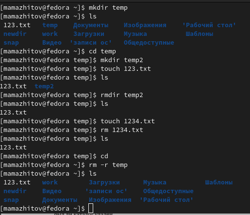{ #fig:019 width=70% }

7. Как воспользоваться историей команд для их модифицированного выполнения? Приведите примеры.
- Команда *history* выводит все ранее выполненные команды, которые нумеруются. Воспльзоавашись !n:s/m/k, где вместо *n* вводим номер команды из истории, вместо *m*, что меняем, а вместо *к*, на что меняем. Например, я в лабораторной работе заменил опцию *а* команды *ls* на *l*
> !201:s/a/l
8. Приведите примеры запуска нескольких команд в одной строке.

- Для использование нескольких команд последовательно в одной строке, необходимо их разделить их символом *";"*. Например,
> cd; ls
9. Дайте определение и приведите примера символов экранирования.
- Экранирование символов — замена в тексте управляющих символов на соответствующие текстовые подстановки. Например, '\.'
10. Охарактеризуйте вывод информации на экран после выполнения команды ls с опцией
l.
- Будет выведена следующая
информация: тип файла, право доступа, число ссылок, владелец, размер, дата последней ревизии, имя файла или каталога.
11. Что такое относительный путь к файлу? Приведите примеры использования относительного и абсолютного пути при выполнении какой-либо команды.
- Относительный показывает путь к файлу относительно какой-либо "отправной точки". Например:
> cd ~/work/study

Данной командой можно перейти в катало study из любой отправной точки, т.е. мы используем абслоютный путь к файлу.

> cd 2021-2022

Данной командой из каталога *study* можно перейти к каталогу *2021-2022*. Такой путь можно назвать относительным.
12. Как получить информацию об интересующей вас команде.
- Воспользоваться командой *man* и через пробел ввести название команды, информацию которой мы хотим получить.
13. Какая клавиша или комбинация клавиш служит для автоматического дополнения вводимых команд?
- Клавиша *Tab* служит для автоматического дополнения вводимых команд.