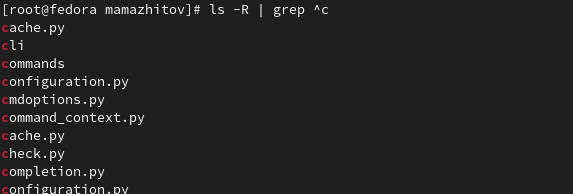

---
## Front matter
lang: ru-RU
title: Лабораторная работы №6 "Поиск файлов. Перенаправление ввода-вывода. Просмотр запущенных процессов"
author: Тулеуов Мади
institute: RUDN University, Moscow, Russian Federation
date:

## Formatting
mainfont: PT Serif
romanfont: PT Serif
sansfont: PT Sans
monofont: PT Mono
toc: false
slide_level: 2
theme: metropolis
header-includes: 
 - \metroset{progressbar=frametitle,sectionpage=progressbar,numbering=fraction}
 - '\makeatletter'
 - '\beamer@ignorenonframefalse'
 - '\makeatother'
aspectratio: 43
section-titles: true
---

## Цель работы:

Ознакомление с инструментами поиска файлов и фильтрации текстовых данных. Приобретение практических навыков: по управлению процессами (и заданиями), по проверке использования диска и обслуживанию файловых систем.

---

## Задачи:

1. Осуществите вход в систему, используя соответствующее имя пользователя.
2. Запишите в файл *file.txt* названия файлов, содержащихся в каталоге */etc*. Допишите в этот же файл названия файлов, содержащихся в вашем домашнем каталоге.
3. Выведите имена всех файлов из *file.txt*, имеющих расширение *.conf*, после чего
запишите их в новый текстовой файл *conf.txt*.
4. Определите, какие файлы в вашем домашнем каталоге имеют имена, начинавшиеся
с символа *c*? Предложите несколько вариантов, как это сделать.

---

## Задачи

5. Выведите на экран (по странично) имена файлов из каталога */etc*, начинающиеся
с символа *h*.
6. Запустите в фоновом режиме процесс, который будет записывать в файл *~/logfile*
файлы, имена которых начинаются с *log*.
7. Удалите файл *~/logfile*.
8. Запустите из консоли в фоновом режиме редактор *gedit*.
9. Определите идентификатор процесса *gedit*, используя команду *ps*, конвейер и фильтр
*grep*. Как ещё можно определить идентификатор процесса? 

---

## Задачи

10. Прочтите справку (man) команды *kill*, после чего используйте её для завершения
процесса *gedit*.
11. Выполните команды *df* и *du*, предварительно получив более подробную информацию
об этих командах, с помощью команды *man*.
12. Воспользовавшись справкой команды *find*, выведите имена всех директорий, имеющихся в вашем домашнем каталоге.

---

## Ход работы

Так как Fedora 35 установлена на мой ноутбук и у меня только одна учетная запись в ней, я уже находился в системе под соответствующим именем пользователя. Для подстраховки я использую рут права.

---

Я поднялся в корневой каталог и, воспользовавшись командой *ls* и перенапралением вывода, записал в *file.txt* название файлов, содержащихся в каталоге */etc*. Затем я дописал в этом же файле названия файлов, содержащихся в моем домашнем каталоге.(рис. [-@fig:001])

{ #fig:001 width=70% }

---

## Ход работы

С помощью команды *grep* вывел имена всех файлов из *file.txt*, имеющих расширение *.conf*.(рис. [-@fig:002])

{ #fig:002 width=70% }

---

## Ход работы

Далее с помощью той же команды и перенаправления вывода я записал имена файлов в *conf.txt*.(рис. [-@fig:003])

---

{ #fig:003 width=70% }
---

## Ход работы

Перешел в домашний каталог и с помощью команды *find* вывел названия всех файлов, начинавшиеся с символа *c*.(рис. [-@fig:003])

{ #fig:003 width=70% }

---

## Ход работы

Затем я сделал то же самое с помощью *ls*, конвейера, и *grep*.(рис. [-@fig:004])

{ #fig:004 width=70% }

---

## Ход работы

Вывел на экран (по странично) имена файлов из каталога */etc*, начинающиеся
с символа *h*, использовав *grep*.(рис. [-@fig:006])

{ #fig:006 width=70% }

---

## Ход работы

В фоновом режиме запустил команду *find* и перенаправление вывода, которые будут записывать в файл *~/logfile* файлы, имена которых начинаются с *log*.(рис. [-@fig:007])

{ #fig:007 width=70% }

---

## Ход работы

Удалил *logfile* .(рис. [-@fig:008])

{ #fig:008 width=70% }

---

## Ход работы

В фоновом режиме запустил gedit.(рис. [-@fig:009])

{ #fig:009 width=70% }

---

## Ход работы

 Определил идентификатор процесса *gedit*, используя команду *ps*, конвейер и фильтр *grep*.(рис. [-@fig:010])

{ #fig:010 width=70% }

---

## Ход работы

 Бегло прочитал справку команды *kill*. Далее, воспользовавшись ею, завершил процесс *gedit*.(рис. [-@fig:011])

{ #fig:011 width=70% }

---

## Ход работы

Предварительно получив более подробную информацию об *df* и *du*, с помощью команды *man*, воспользовался ими.(рис. [-@fig:012;-@fig:013])

{ #fig:012 width=70% }

---

{ #fig:013 width=70% }

---

## Ход работы

С помощью команды *find* вывел название директорий, находящихся в домашнем каталоге.(рис. [-@fig:014])

---

{ #fig:014 width=70% }

---

## Вывод

Мы научились пользоваться инструментами поиска файлов и фильтрации текстовых данных. Приобрели практические навыки: по управлению процессами (и заданиями), по проверке использования диска и обслуживанию файловых систем.
