---
## Front matter
lang: ru-RU
title: Лабораторная работы №7 "Командная оболочка Midnight Commander"
author: Тулеуов Мади
institute: RUDN University, Moscow, Russian Federation
date:

## Formatting
mainfont: PT Serif
romanfont: PT Serif
sansfont: PT Sans
monofont: PT Mono
toc: false
slide_level: 2
theme: metropolis
header-includes: 
 - \metroset{progressbar=frametitle,sectionpage=progressbar,numbering=fraction}
 - '\makeatletter'
 - '\beamer@ignorenonframefalse'
 - '\makeatother'
aspectratio: 43
section-titles: true
---

## Цель работы:

Освоение основных возможностей командной оболочки Midnight Commander. Приобретение навыков практической работы по просмотру каталогов и файлов; манипуляций
с ними.

---

## Задачи

1. Изучить информацию о mc, вызвав в командной строке man mc.
2. Запустить из командной строки mc, изучить его структуру и меню.
3. Выполнить несколько операций в mc, используя управляющие клавиши (операции с панелями; выделение/отмена выделения файлов, копирование/перемещение файлов, получение информации о размере и правах доступа на файлы и/или каталоги и т.п.)
4. Выполнить основные команды меню левой (или правой) панели. Оценить степень подробности вывода информации о файлах.

---

## Задачи

5. Используя возможности подменю Файл, выполните:
- просмотр содержимого текстового файла;
- редактирование содержимого текстового файла (без сохранения результатов
редактирования);
- создание каталога;
- копирование в файлов в созданный каталог.
6. С помощью соответствующих средств подменю Команда осуществите:
- поиск в файловой системе файла с заданными условиями (например, файла
с расширением .c или .cpp, содержащего строку main);
- выбор и повторение одной из предыдущих команд;
- переход в домашний каталог;
- анализ файла меню и файла расширений.

---

## Задачи

7. Вызовите подменю Настройки . Освойте операции, определяющие структуру экрана mc
(Full screen, Double Width, Show Hidden Files и т.д.).

---

## Задачи по встроенному редактору mc

1. Создайте текстовой файл text.txt.
2. Откройте этот файл с помощью встроенного в mc редактора.
3. Вставьте в открытый файл небольшой фрагмент текста, скопированный из любого
другого файла или Интернета.
4. Проделайте с текстом следующие манипуляции, используя горячие клавиши:
    - Удалите строку текста.
    - Выделите фрагмент текста и скопируйте его на новую строку.
    - Выделите фрагмент текста и перенесите его на новую строку.

---

## Задачи по встроенному редактору mc

  - Сохраните файл.
  - Отмените последнее действие.
  - Перейдите в конец файла (нажав комбинацию клавиш) и напишите некоторый
  текст.
  - Перейдите в начало файла (нажав комбинацию клавиш) и напишите некоторый
    текст.
  - Сохраните и закройте файл.
5. Откройте файл с исходным текстом на некотором языке программирования (например C или Java)
6. Используя меню редактора, включите подсветку синтаксиса, если она не включена,
или выключите, если она включена.

---

## Ход работы

Вызвал информацию о *mc* с помощью *man*. (рис. [-@fig:001])

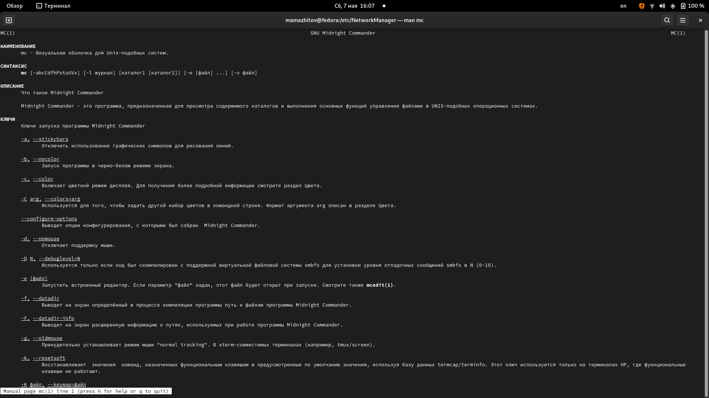{ #fig:001 width=70% }

---

Открыл mc, изучил его структуру и меню. Выполнил несколько операций, таких как копирование, перемещение, получение информации о правах доступа.(рис. [-@fig:002;-@fig:003;-@fig:004])

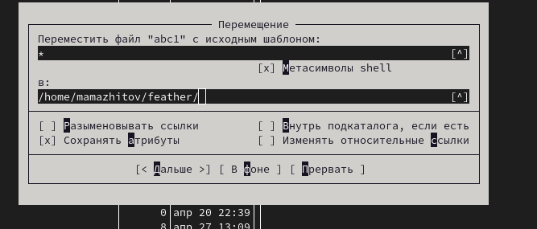{ #fig:002 width=70% }

---

## Ход работы

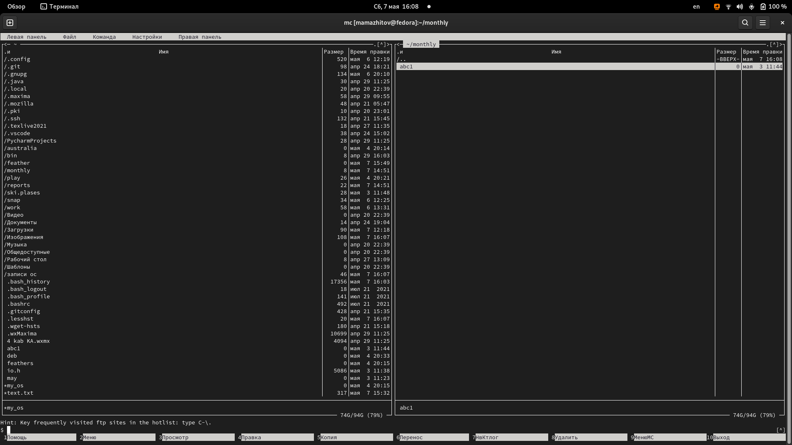{ #fig:003 width=70% }

---

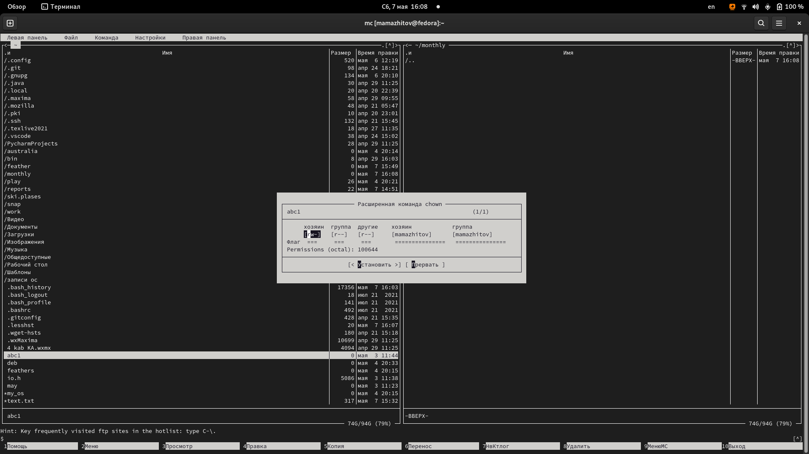{ #fig:004 width=70% }

---

## Ход работы

Выполнил основные команды меню левой панели.(рис. [-@fig:005;-@fig:006;-@fig:007;-@fig:008])

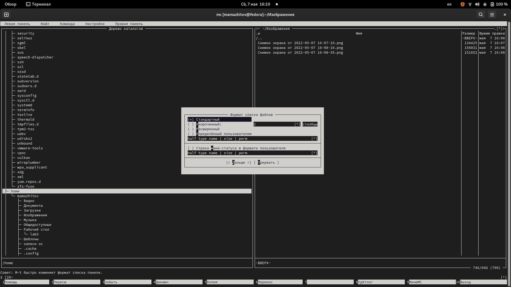{ #fig:005 width=70% }

---

## Ход работы

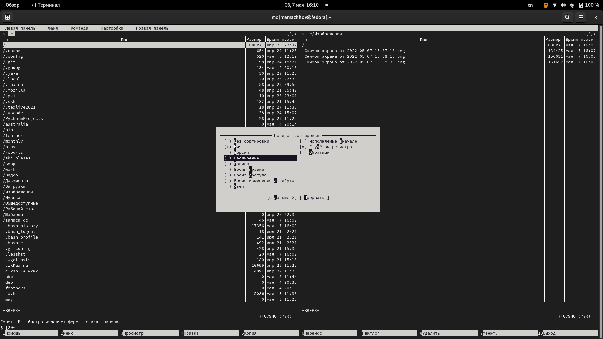{ #fig:006 width=70% }

---

## Ход работы

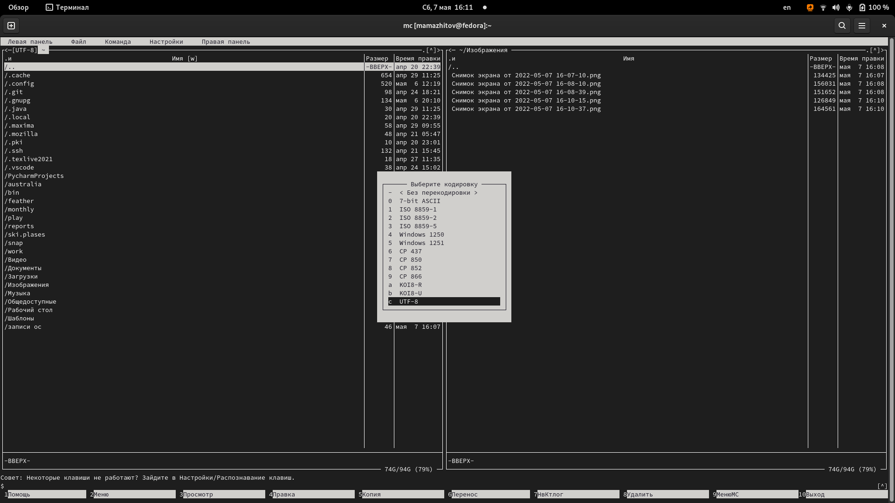{ #fig:007 width=70% }

---

## Ход работы

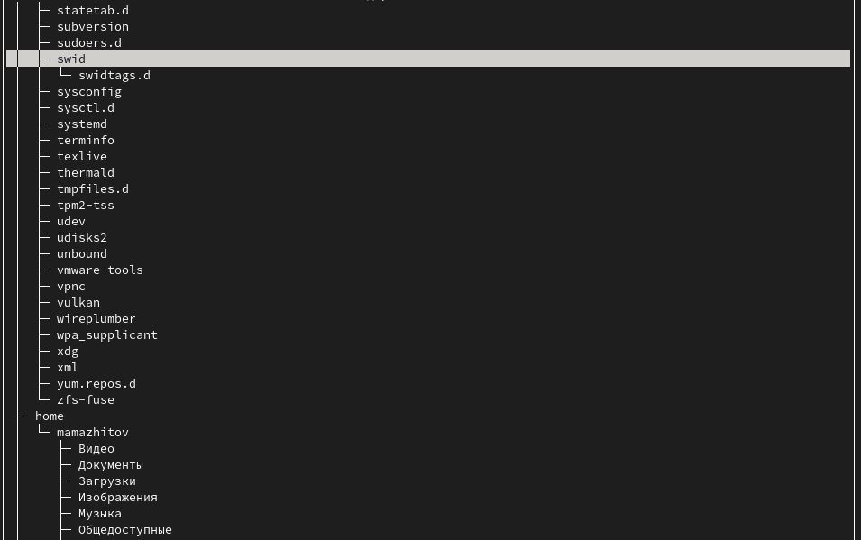{ #fig:008 width=70% }

---

## Ход работы

С помощью возможностей подменю *Файл*:
  
  - просмотрел содержимое файла abc1(он пустой); (рис. [-@fig:009])
      
  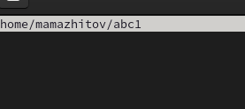{ #fig:009 width=70% }

---

## Ход работы

- отредактировал содержимое файла abc1 и вышел , сохранив все изменения; (рис. [-@fig:010])
    
  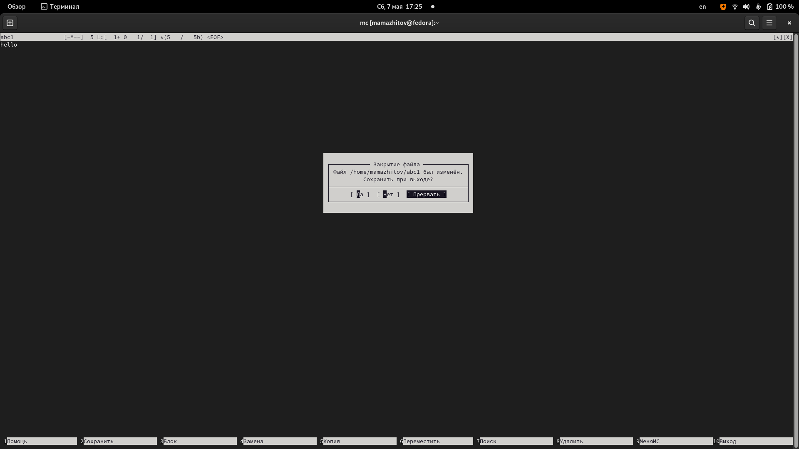{ #fig:010 width=70% }

---

## Ход работы

- создал каталог *debs* и копировал в него файл *deb*; (рис. [-@fig:011])
    
  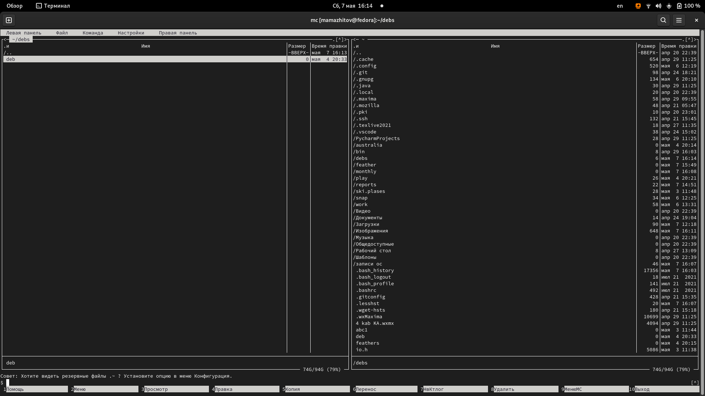{ #fig:011 width=70% }

---

## Ход работы

С помощью подменю *Команда* выполнил следующие действия:
  - поиск файлов, имена которых содержат *main*; (рис. [-@fig:012])

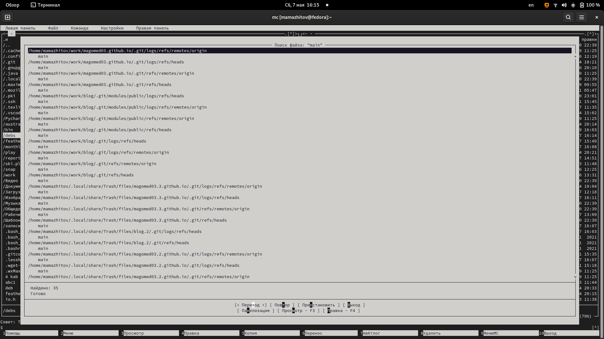{ #fig:012 width=70% }

---

## Ход работы

- выбрал из истории команду переходу в *feathers* и выполнил ее; (рис. [-@fig:013])

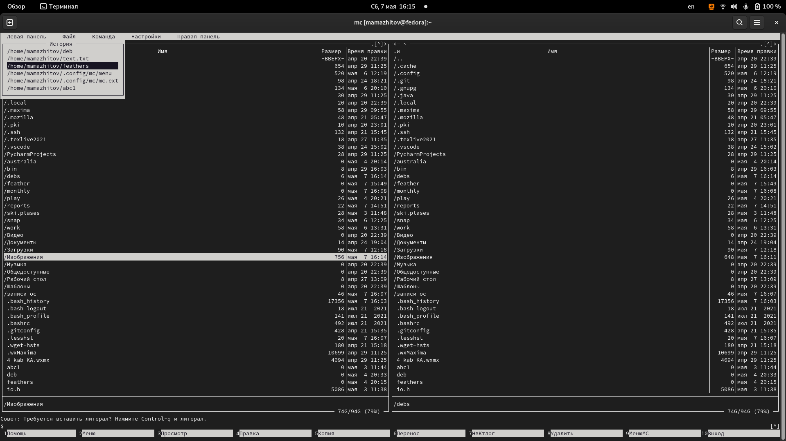{ #fig:013 width=70% }

---

## Ход работы

- перешел в домашний каталог и вывел файл расширений; (рис. [-@fig:014])

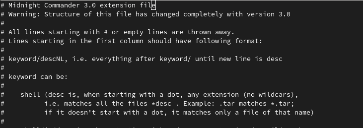{ #fig:014 width=70% }

---

## Ход работы

- вывел файл меню; (рис. [-@fig:015])

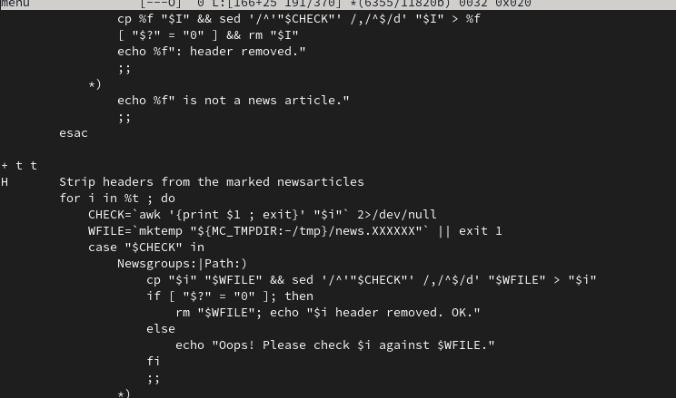{ #fig:015 width=70% }

---

## Ход работы

Вызвал подменю *Настройки* и освоил операции, определяющие структуру экрана mc. (рис. [-@fig:016;-@fig:017])

---

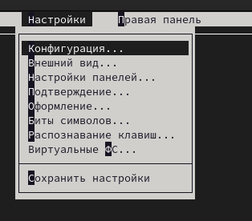{ #fig:016 width=70% }

---

## Ход работы

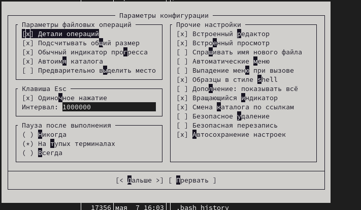{ #fig:017 width=70% }

---

## Ход работы

Создал текстовый файл *text.txt* и открыл его с помощью встроенного редактора mc/ (рис. [-@fig:018])

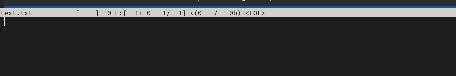{ #fig:018 width=70% }

---

## Ход работы

Вставил текст из интернета в файл.(рис. [-@fig:019])

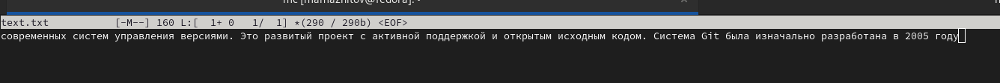{ #fig:019 width=70% }

---

## Ход работы

Разделил текст на несколько строк и удалил одну из них.(рис. [-@fig:020])

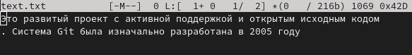{ #fig:020 width=70% }

---

## Ход работы

Скопировал фрагмент текста на новую строку. (рис. [-@fig:021])

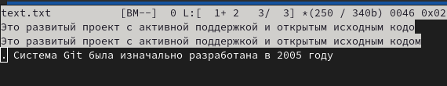{ #fig:021 width=70% }

---

## Ход работы

Переместил фрагмент текста на новую строку.(рис. [-@fig:022])

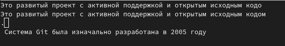{ #fig:022 width=70% }

---

## Ход работы

Отменил последенее действие(пермещение фрагмента текста). (рис. [-@fig:023])

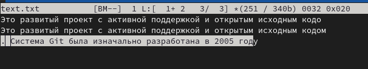{ #fig:023 width=70% }

---

## Ход работы

Переместился в конец файла, написал *htllo*. Затем сделал то же самое в начале файла. (рис. [-@fig:024])

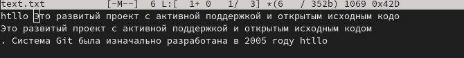{ #fig:024 width=70% }

---

## Ход работы

Закрыл файл, сохранив его. (рис. [-@fig:025])

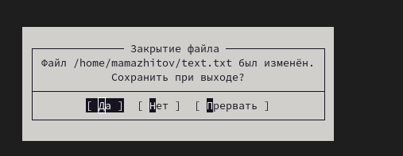{ #fig:025 width=70% }

---

## Ход работы

Используя меню редактора выключил подсветку синтаксиса. (рис. [-@fig:026])

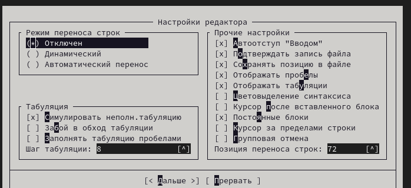{ #fig:026 width=70% }

---

## Вывод

Мы получили базовые навыки использования Midnight Commander.