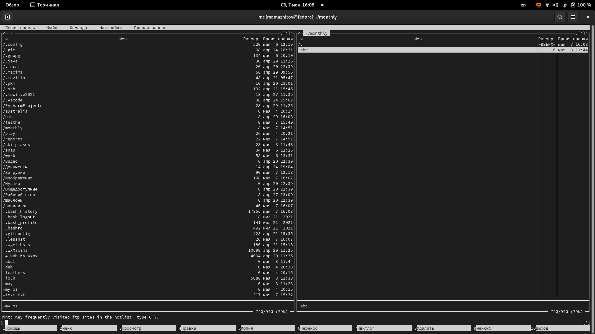
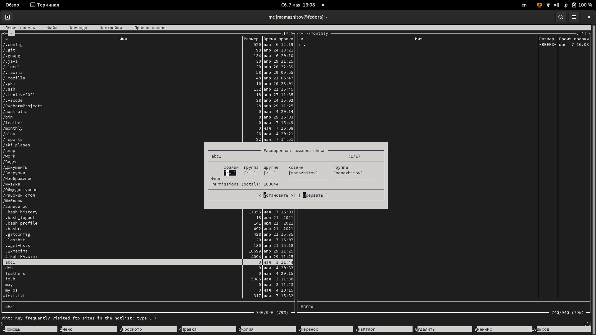
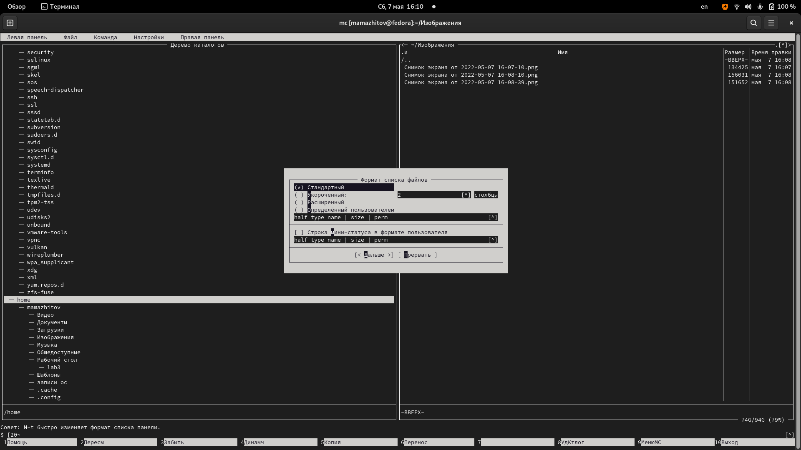
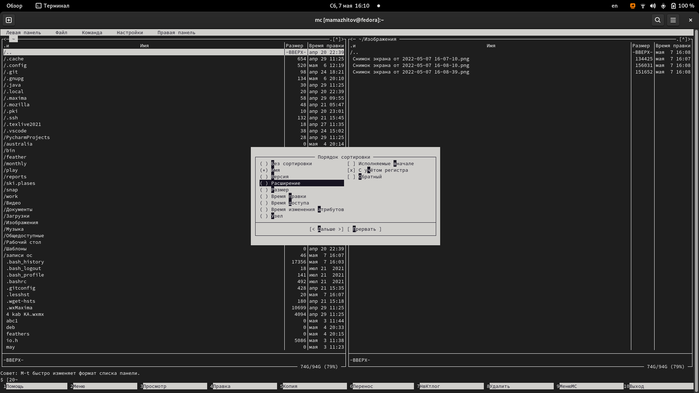
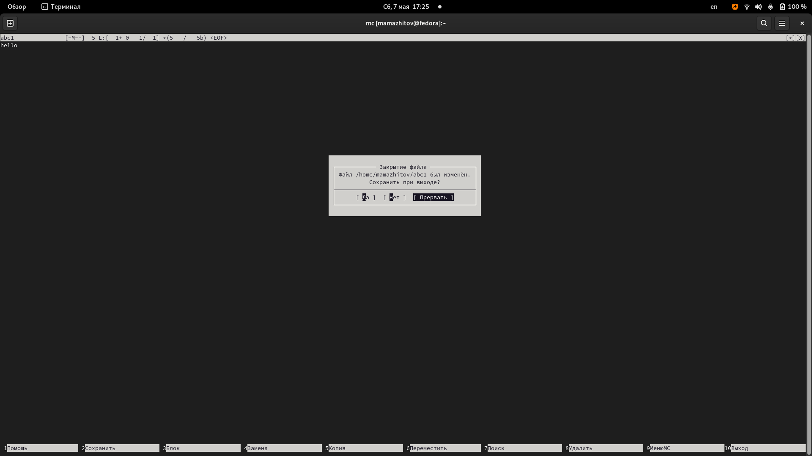
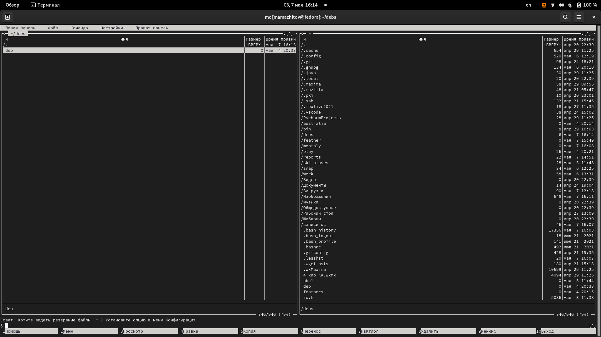
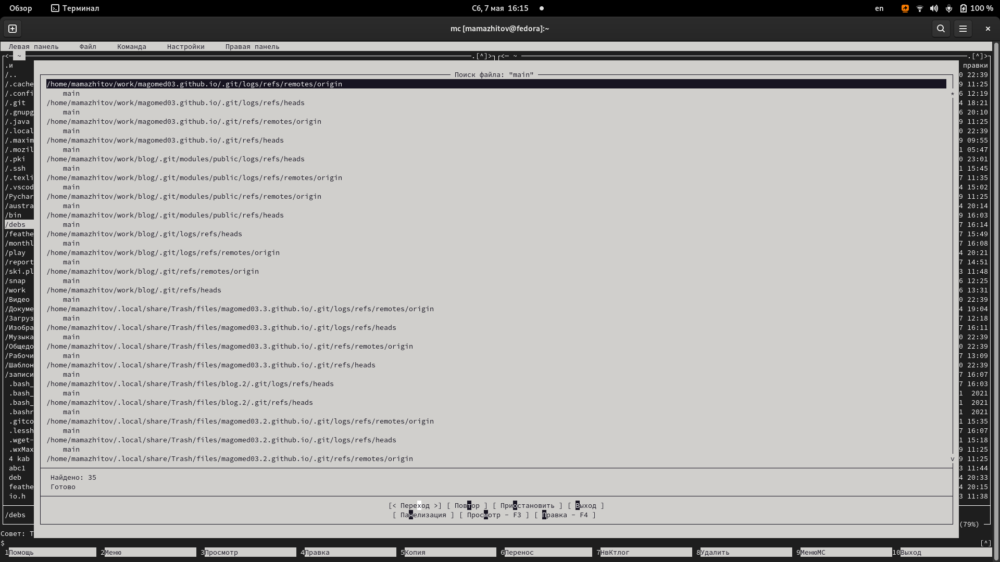
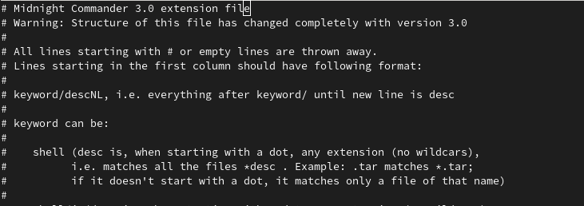
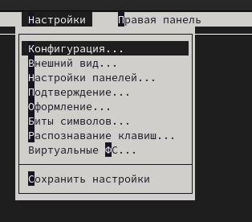

---
## Front matter
title: "Лабораторная работа №7"
subtitle: "Командная оболочка Midnight Commander"
author: "Тулеуов Мади"

## Generic otions
lang: ru-RU
toc-title: "Содержание"

## Bibliography
bibliography: bib/cite.bib
csl: pandoc/csl/gost-r-7-0-5-2008-numeric.csl

## Pdf output format
toc: true # Table of contents
toc-depth: 2
lof: true # List of figures
lot: true # List of tables
fontsize: 12pt
linestretch: 1.5
papersize: a4
documentclass: scrreprt
## I18n polyglossia
polyglossia-lang:
  name: russian
  options:
	- spelling=modern
	- babelshorthands=true
polyglossia-otherlangs:
  name: english
## I18n babel
babel-lang: russian
babel-otherlangs: english
## Fonts
mainfont: PT Serif
romanfont: PT Serif
sansfont: PT Sans
monofont: PT Mono
mainfontoptions: Ligatures=TeX
romanfontoptions: Ligatures=TeX
sansfontoptions: Ligatures=TeX,Scale=MatchLowercase
monofontoptions: Scale=MatchLowercase,Scale=0.9
## Biblatex
biblatex: true
biblio-style: "gost-numeric"
biblatexoptions:
  - parentracker=true
  - backend=biber
  - hyperref=auto
  - language=auto
  - autolang=other*
  - citestyle=gost-numeric
## Pandoc-crossref LaTeX customization
figureTitle: "Рис."
tableTitle: "Таблица"
listingTitle: "Листинг"
lofTitle: "Список иллюстраций"
lotTitle: "Список таблиц"
lolTitle: "Листинги"
## Misc options
indent: true
header-includes:
  - \usepackage{indentfirst}
  - \usepackage{float} # keep figures where there are in the text
  - \floatplacement{figure}{H} # keep figures where there are in the text
---

# Цель работы

Освоение основных возможностей командной оболочки Midnight Commander. Приобретение навыков практической работы по просмотру каталогов и файлов; манипуляций
с ними.

# Задания по mc

1. Изучите информацию о mc, вызвав в командной строке man mc.
2. Запустите из командной строки mc, изучите его структуру и меню.
3. Выполните несколько операций в mc, используя управляющие клавиши (операции
с панелями; выделение/отмена выделения файлов, копирование/перемещение файлов, получение информации о размере и правах доступа на файлы и/или каталоги
и т.п.)
4. Выполните основные команды меню левой (или правой) панели. Оцените степень
подробности вывода информации о файлах.
5. Используя возможности подменю Файл , выполните:
– просмотр содержимого текстового файла;
– редактирование содержимого текстового файла (без сохранения результатов
редактирования);
– создание каталога;
– копирование в файлов в созданный каталог.
6. С помощью соответствующих средств подменю Команда осуществите:
– поиск в файловой системе файла с заданными условиями (например, файла
с расширением .c или .cpp, содержащего строку main);
– выбор и повторение одной из предыдущих команд;
– переход в домашний каталог;
– анализ файла меню и файла расширений.
7. Вызовите подменю Настройки . Освойте операции, определяющие структуру экрана mc
(Full screen, Double Width, Show Hidden Files и т.д.).

# Задание по встроенному редактору mc

1. Создайте текстовой файл text.txt.
2. Откройте этот файл с помощью встроенного в mc редактора.
3. Вставьте в открытый файл небольшой фрагмент текста, скопированный из любого
другого файла или Интернета.
4. Проделайте с текстом следующие манипуляции, используя горячие клавиши:
    1. Удалите строку текста.
    2. Выделите фрагмент текста и скопируйте его на новую строку.
    3. Выделите фрагмент текста и перенесите его на новую строку.
    4. Сохраните файл.
    5. Отмените последнее действие.
    6. Перейдите в конец файла (нажав комбинацию клавиш) и напишите некоторый
    текст.
    7. Перейдите в начало файла (нажав комбинацию клавиш) и напишите некоторый
    текст.
    8. Сохраните и закройте файл.
5. Откройте файл с исходным текстом на некотором языке программирования (например C или Java)
6. Используя меню редактора, включите подсветку синтаксиса, если она не включена,
или выключите, если она включена.

# Ход работы

**1.** Вызвал информацию о *mc* с помощью *man*. (рис. [-@fig:001])

{ #fig:001 width=70% }

**2.** Открыл mc, изучил его структуру и меню. Выполнил несколько операций, таких как копирование, перемещение, получение информации о правах доступа.(рис. [-@fig:002;-@fig:003;-@fig:004])

{ #fig:002 width=70% }

{ #fig:003 width=70% }

{ #fig:004 width=70% }

**3.** Выполнил основные команды меню левой панели.(рис. [-@fig:005;-@fig:006;-@fig:007;-@fig:008])

{ #fig:005 width=70% }

{ #fig:006 width=70% }

{ #fig:007 width=70% }

{ #fig:008 width=70% }

**4.** С помощью возможностей подменю *Файл*:
  
  - просмотрел содержимое файла abc1(он пустой); (рис. [-@fig:009])
      
  { #fig:009 width=70% }
    
  - отредактировал содержимое файла abc1 и вышел , сохранив все изменения; (рис. [-@fig:010])
    
  { #fig:010 width=70% }

  - создал каталог *debs* и копировал в него файл *deb*; (рис. [-@fig:011])
    
  { #fig:011 width=70% }

**5.** С помощью подменю *Команда* выполнил следующие действия:
  - поиск файлов, имена которых содержат *main*; (рис. [-@fig:012])

{ #fig:012 width=70% }

- выбрал из истории команду переходу в *feathers* и выполнил ее; (рис. [-@fig:013])

{ #fig:013 width=70% }

- перешел в домашний каталог и вывел файл расширений; (рис. [-@fig:014])

{ #fig:014 width=70% }

- вывел файл меню; (рис. [-@fig:015])

{ #fig:015 width=70% }

**6.** Вызвал подменю *Настройки* и освоил операции, определяющие структуру экрана mc. (рис. [-@fig:016;-@fig:017])

{ #fig:016 width=70% }

{ #fig:017 width=70% }

**7.** Создал текстовый файл *text.txt* и открыл его с помощью встроенного редактора mc/ (рис. [-@fig:018])

{ #fig:018 width=70% }

**8.** Вставил текст из интернета в файл.(рис. [-@fig:019])

{ #fig:019 width=70% }

**9.** Разделил текст на несколько строк и удалил одну из них.(рис. [-@fig:020])

{ #fig:020 width=70% }

**10.** Скопировал фрагмент текста на новую строку. (рис. [-@fig:021])

{ #fig:021 width=70% }

**11.** Переместил фрагмент текста на новую строку.(рис. [-@fig:022])

{ #fig:022 width=70% }

**11.** Отменил последенее действие(пермещение фрагмента текста). (рис. [-@fig:023])

{ #fig:023 width=70% }

**12.** Переместился в конец файла, написал *htllo*. Затем сделал то же самое в начале файла. (рис. [-@fig:024])

{ #fig:024 width=70% }

**13.** Закрыл файл, сохранив его. (рис. [-@fig:025])

{ #fig:025 width=70% }

**12.** Используя меню редактора выключил подсветку синтаксиса. (рис. [-@fig:026])

{ #fig:026 width=70% }

# Вывод

Мы получили базовые навыки использования Midnight Commander.

# Контрольные вопросы.

1) mc - визуальная файловая оболочка для UNIX/Linux систем, аналог Far, Norton
Commander, но оболочки в Linux несравненно богаче. На языке командной оболочки можно
писать небольшие программы для выполнения ряда последовательных операций с файлами и
содержащимися в них данными.
Команда Переставить панели (Ctrl+U) меняет местами содержимое правой и левой
панелей.Команде Отключить панели (Ctrl+O). По команде Сравнить каталоги (Ctrl-X,D)
сравнивается содержимое каталогов, отображаемых на левой и правой панелях. Помимо того,
что может задаваться формат вывода на панель списка файлов, любую панель можно
перевести в один из следующих режимов:
- Режим "Информация". В этом режиме на панель выводится информация о подсвеченном в
другой панели файле и о текущей файловой системе.
- Режим "Дерево". В режиме отображения дерева каталогов в одной из панелей выводится
графическое изображение структуры дерева каталогов. Этот режим подобен тому, который
вы увидите, выбрав команду Дерево каталогов из меню Команды, только в последнем случае
изображение структуры каталогов выводится в отдельное окно. Левая Панель и Правая
Панель меню (левой/правой панели) позволяют оперировать режимами отображения
панелей.
Меню Левая Панель и Правая Панель позволяют оперировать панелями.
Формат списка бывает:
- Стандартный – вывод списка файлов и каталогов по умолчанию;
- Ускоренный – имена файла или каталогов;
- Расширенный – атрибуты, владелец, группа и размер;
- Определённый пользователем – имя, размер и атрибуты;
Быстрый просмотр – выполняет быстрый просмотр содержимого панели. Информация –
выдает всю имеющуюся информацию о файле или каталоге.
Порядок сортировки – бывает: без сортировки, по имени, расширенный, время правки, время
правки, время доступа, время изменение атрибута, размер, узел.

2) Командные интерпретатор Shell и оболочка Midnight Commander имеют похожую
структуру и многие одинаковые команды можно выполнить в обоих оболочках:
- Системная информация
- Поиск
- Копирование

3) Меню левой панели
Подпункты меню:
- Список файлов показывает файлы в домашнем каталоге.
- Быстрый просмотр позволяет выполнить быстрый просмотр содержимого панели.
- Информация позволяет посмотреть информацию о файле или каталоге
- Командная оболочка Midnight Commander В меню каждой (левой или правой) панели
можно выбрать Формат списка: стандартный, ускоренный, расширенный и определённый
пользователем.
- Порядок сортировки позволяет задать критерии сортировки при выводе списка файлов и
каталогов: без сортировки, по имени, расширенный, время правки, время доступа, время
изменения атрибута, размер, узел.

4) Меню файл
Подпункты меню:
- Просмотр ( F3 ) позволяет посмотреть содержимое текущего файла без возможности
редактирования.
- Просмотр вывода команды ( М + ! ) функция запроса команды с параметрами.
- Правка ( F4 ) открывает текущий (или выделенный) файл для его редактирования.
- Копирование ( F5 ) осуществляет копирование одного или нескольких файлов или каталогов
в указанное пользователем во всплывающем окне место.
- Права доступа ( Ctrl-x c ) позволяет изменить права доступа к одному или нескольким
файлам или каталогам.
- Права доступа на файлы и каталоги
- Жёсткая ссылка ( Ctrl-x l ) позволяет создать жёсткую ссылку к текущему (или
выделенному) файлу1 .
- Символическая ссылка ( Ctrl-x s ) — позволяет создать символическую ссылку к текущему
файлу .
- Владелец группы ( Ctrl-x o ) позволяет задать владельца и имя группы для одного или
нескольких файлов или каталогов.
- Права (расширенные) позволяет изменить права доступа и владения для одного или
нескольких файлов или каталогов.
- Переименование ( F6 ) позволяет переименовать один или несколько файлов или каталогов.
- Создание каталога ( F7 ) позволяет создать каталог.
- Удалить ( F8 ) позволяет удалить один или несколько файлов или каталогов.
- Выход ( F10 ) завершает работу mc.

5) Меню команда
Подпункты меню:
- Дерево каталогов отображает структуру каталогов системы.
- Поиск файла выполняет поиск файлов по заданным параметрам.
- Переставить панели меняет местами левую и правую панели.
- Сравнить каталоги ( Ctrl-x d ) сравнивает содержимое двух каталогов.
- Размеры каталогов отображает размер и время изменения каталога (по умол- чанию в mc
размер каталога корректно не отображается).
- История командной строки выводит на экран список ранее выполненных в оболочке
команд.
- Каталоги быстрого доступа ( Ctrl-\ ) при вызове выполняется быстрая смена текущего
- каталога на один из заданного списка.
- Восстановление файлов позволяет восстановить файлы на файловых систе- мах ext2 и ext3.
- Редактировать файл расширений позволяет задать с помощью определённого синтаксиса
действия при запуске файлов с определённым расширением (напри- мер, какое программного
обеспечение запускать для открытия или редактирова- ния файлов с расширением .c
или .cpp).
- Редактировать файл меню позволяет отредактировать контекстное меню поль- зователя,
вызываемое по клавише F2 .
- Редактировать файл расцветки имён позволяет подобрать оптимальную для пользователя
расцветку имён файлов в зависимости от их типа.

6) Меню настройки
Подпункты меню:
- Конфигурация позволяет скорректировать настройки работы с панелями.
- Внешний вид и Настройки панелей определяет элементы, отображаемые при вызове mc, а
также цветовое выделение.
- Биты символов задаёт формат обработки информации локальным термина- лом.
- Подтверждение позволяет установить или убрать вывод окна с запросом подтверждения
действий при операциях удаления и перезаписи файлов, а также при выходе из программы.
- Распознание клавиш диалоговое окно используется для тестирования функциональных
клавиш, клавиш управления курсором и прочее.
- Виртуальные ФС настройки виртуальной файловой системы: тайм-аут, пароль и прочее.

7) Встроенные команды mc:
- F1 Вызов контекстно-зависимой подсказки.
- F2 Вызов пользовательского меню с возможностью создания and/or.
- F3 Просмотр содержимого файла, на который указывает подсветка в активной панели.
- F4 Вызов встроенного в mc редактора для изменения содержания файла, на который
- указывает подсветка в активной панели.
- F5 Копирование одного или нескольких файлов, отмеченных в первой (активной) панели, в
каталог, отображаемый на второй панели.
- F6 Перенос одного или нескольких файлов, отмеченных в первой панели, в каталог,
отображаемый на второй панели.
- F7 Создание подкаталога в каталоге, отображаемом в активной панели.
- F8 Удаление одного или нескольких файлов, отмеченных в первой панели файлов.
- F9 Вызов меню mc.
- F10 Выход из mc.

8) Команды mc :
- Ctrl+y удалить строку.
- Ctrl+u отмена последней операции.
- Ins вставка/замена.
- F7 поиск.
- Shift+F7 повтор последней операции поиска.
- F4 замена файла.
- F3 первое нажатие начало выделения, второе это окончание выделения.
- F5 копировать выделенный фрагмент F6 переместить выделенный фрагмент.
- F8 удалить выделенный фрагмент.
- F2 записать изменения в файл.
- F10 выйти из редактора.

9) Один из четырех форматов списка в Midnight Commander –пользовательский,
определённый самим пользователем позволяет ему редактировать меню любого из двух
списков. А меню пользователя – это меню, состоящее из команд, определенных
пользователем. При вызове меню используется файл ~/.mc.menu. Если такого файла нет, то
по умолчанию используется системный файл меню /usr/lib/mc/mc.menu. Все строки в этих
файлах , начинающиеся с пробела или табуляции, являются командами, которые
выполняются при выборе записи.

10) Когда мы выделяем файл не являющегося исполняемым, Midnight Commander сравнивает
расширение выбранного файла с расширениями, прописанными в «файле расширений» ~/
mc.ext. Если в файле расширений найдется подраздел, задающий процедуры обработки
файлов с данным расширением, то обработка файла производится в соответствии с
заданными в этом подразделе командами и файлами:
- файл помощи для MC. /usr/lib/mc.hlp
- файл расширений, используемый по умолчанию. /usr/lib/mc/mc.ext
- файл расширений, конфигурации редактора. $HOME/.mc.ext
- системный инициализационный файл. /usr/lib/mc/mc.ini
- фаил который содержит основные установки. /usr/lib/mc/mc.lib
- инициализационный файл пользователя. Если он существует, то системный файл mc.ini
игнорируется. $HOME/.mc.ini
- этот файл содержит подсказки, отображаемые в нижней части экрана. /usr/lib/mc/mc.hint
- системный файл меню MC, используемый по умолчанию. /usr/lib/mc/mc.menu
- файл меню пользователя. Если он существует, то системный файл меню игнорируется.
$HOME/.mc.menu
- инициализационный файл пользователя. Если он существует, то системный файл mc.ini
игнорируется. $HOME/.mc.tree