---
## Front matter
lang: ru-RU
title: Лабораторная работы №8 "Текстовой редактор vi"
author: Тулеуов Мади
institute: RUDN University, Moscow, Russian Federation
date:

## Formatting
mainfont: PT Serif
romanfont: PT Serif
sansfont: PT Sans
monofont: PT Mono
toc: false
slide_level: 2
theme: metropolis
header-includes: 
 - \metroset{progressbar=frametitle,sectionpage=progressbar,numbering=fraction}
 - '\makeatletter'
 - '\beamer@ignorenonframefalse'
 - '\makeatother'
aspectratio: 43
section-titles: true
---

## Цель работы:

Познакомиться с операционной системой Linux. Получить практические навыки работы с редактором vi, установленным по умолчанию практически во всех дистрибутивах.

---

## Задачи

1. Создать каталог с именем */work/os/lab06*.
2. Перейти во вновь созданный каталог.
3. Вызвать vi и создать файл hello.sh
4. Нажать клавишу i и ввести приложенный текст.
5. Нажать клавишу Esc для перехода в командный режим после завершения ввода текста.

---

## Задачи

6. Нажать *:* для перехода в режим последней строки и внизу нашего экрана появится приглашение в виде двоеточия.
7. Нажать w (записать) и q (выйти), а затем нажать клавишу Enter для сохранения нашего текста и завершения работы.
8. Сделать файл исполняемым
9. Вызвать vi на редактирование файла
10. Установить курсор в конец слова *HELL* второй строки.

---

## Задачи

11. Перейти в режим вставки и заменить на *HELLO*. Нажать *Esc* для возврата в командный режим.
12. Установить курсор на четвертую строку и стереть слово *LOCAL*.
13. Перейти в режим вставки и набрать следующий текст: *local*, нажать *Esc* для возврата в командный режим.
14. Установить курсор на последней строке файла. Вставить после неё строку, содержащую следующий текст: *echo $HELLO*.

---

## Задачи

15. Нажать *Esc* для перехода в командный режим.
16. Удалить последнюю строку.
17. Ввести команду отмены изменений *u* для отмены последней команды.
18. Ввести символ *:* для перехода в режим последней строки. Записать произведённые изменения и выйти из vi.

---

## Ход работы

**1.** Создал каталог с именем */work/os/lab06*. (рис. [-@fig:001])

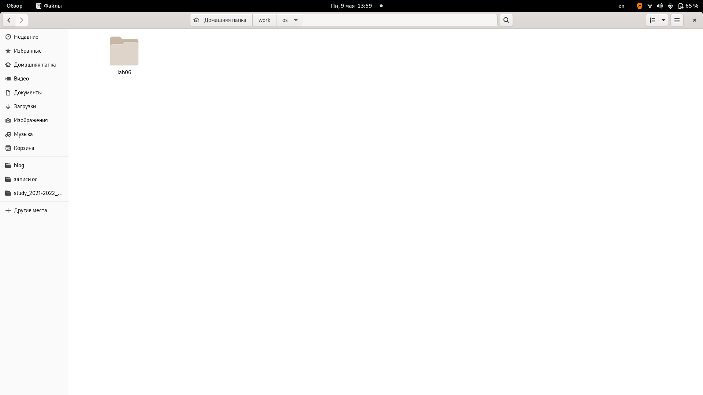{ #fig:001 width=70% }

---

## Ход работы

**2.**Перешел в созданный каталог, вызвал vi и создал файл *hello.sh*. (рис. [-@fig:002])

{ #fig:002 width=70% }

---

## Ход работы

**3.** Ввел необходимый текст.(рис. [-@fig:003])

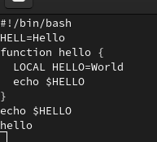{ #fig:003 width=70% }

---

## Ход работы

**4.** Перешел в командном режиме на последнюю строку и завершил работу *vi*, сохранив все изменения.(рис. [-@fig:004])

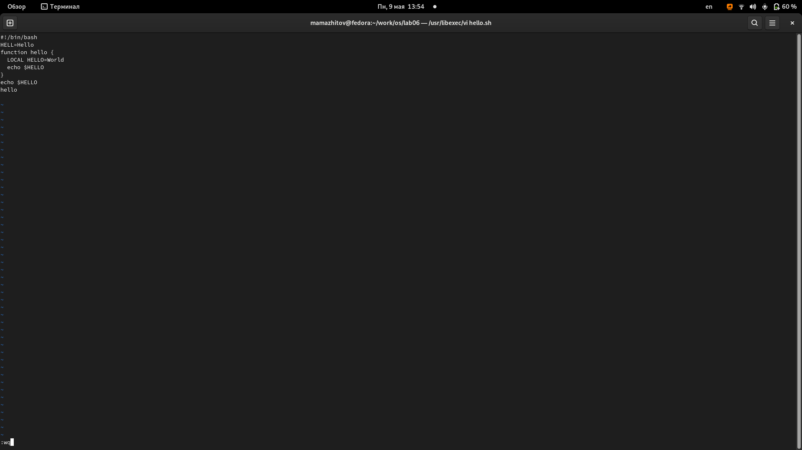{ #fig:004 width=70% }

---

## Ход работы

**5.** Сделал файл исполняемым.(рис. [-@fig:005])

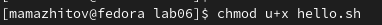{ #fig:005 width=70% }

---

## Ход работы

**6.** Вызвал редактор *vi*. (рис. [-@fig:006])

{ #fig:006 width=70% }

---

## Ход работы

**7.** Установил курсор в конец слова HELL второй строки, перешел в режим вставки и дописал в конце слова букву *О*(рис. [-@fig:007])

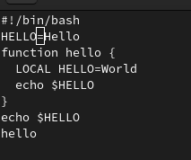{ #fig:007 width=70% }

---

## Ход работы

**8.** Перешел на четвертую строку и стер слово *LOCAL*.(рис. [-@fig:008])

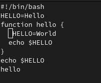{ #fig:008 width=70% }

---

## Ход работы

**9.** Перешел в режим вставки и набрал слово *local*.(рис. [-@fig:009])

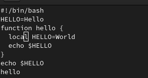{ #fig:009 width=70% }

---

## Ход работы

**10.** Перешел в конец файла и вставил *echo $HELLO*. (рис. [-@fig:010])

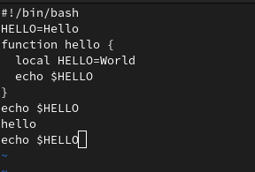{ #fig:010 width=70% }

---

## Ход работы

**11.** Перешел в командный режим и удалил последнюю строку.(рис. [-@fig:011])

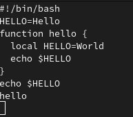{ #fig:011 width=70% }

---

## Ход работы

**12.** Отменил последнее действие. (рис. [-@fig:012])

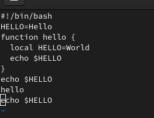{ #fig:012 width=70% }

---

## Ход работы

**13.** Закрыл редактор, сохранив все изменения. (рис. [-@fig:013])

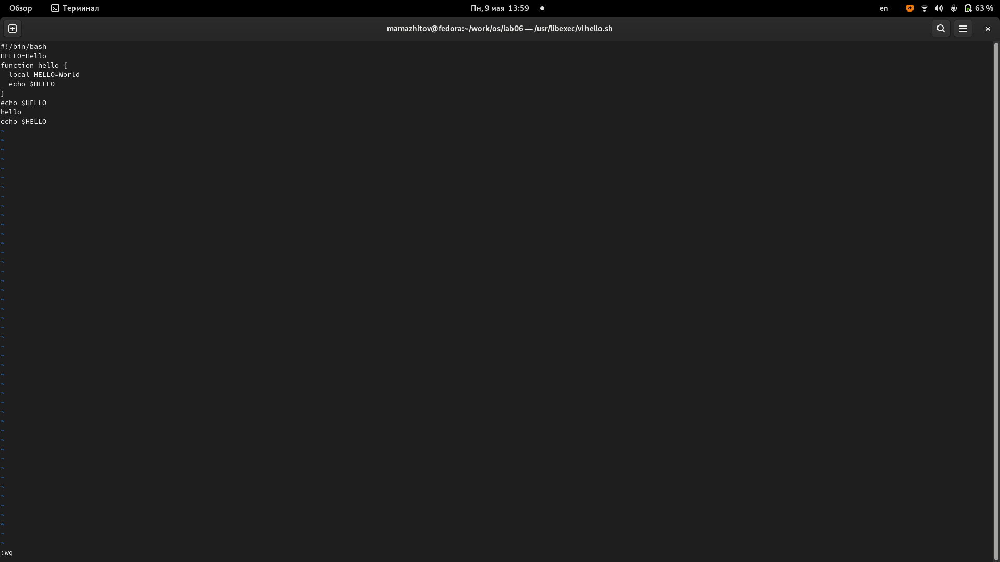{ #fig:013 width=70% }

---

## Вывод

Мы получили базовые навыки использования vi.