---
## Front matter
title: "Лабораторная работа №8"
subtitle: "Текстовой редактор vi"
author: "Тулеуов Мади"

## Generic otions
lang: ru-RU
toc-title: "Содержание"

## Bibliography
bibliography: bib/cite.bib
csl: pandoc/csl/gost-r-7-0-5-2008-numeric.csl

## Pdf output format
toc: true # Table of contents
toc-depth: 2
lof: true # List of figures
lot: true # List of tables
fontsize: 12pt
linestretch: 1.5
papersize: a4
documentclass: scrreprt
## I18n polyglossia
polyglossia-lang:
  name: russian
  options:
	- spelling=modern
	- babelshorthands=true
polyglossia-otherlangs:
  name: english
## I18n babel
babel-lang: russian
babel-otherlangs: english
## Fonts
mainfont: PT Serif
romanfont: PT Serif
sansfont: PT Sans
monofont: PT Mono
mainfontoptions: Ligatures=TeX
romanfontoptions: Ligatures=TeX
sansfontoptions: Ligatures=TeX,Scale=MatchLowercase
monofontoptions: Scale=MatchLowercase,Scale=0.9
## Biblatex
biblatex: true
biblio-style: "gost-numeric"
biblatexoptions:
  - parentracker=true
  - backend=biber
  - hyperref=auto
  - language=auto
  - autolang=other*
  - citestyle=gost-numeric
## Pandoc-crossref LaTeX customization
figureTitle: "Рис."
tableTitle: "Таблица"
listingTitle: "Листинг"
lofTitle: "Список иллюстраций"
lotTitle: "Список таблиц"
lolTitle: "Листинги"
## Misc options
indent: true
header-includes:
  - \usepackage{indentfirst}
  - \usepackage{float} # keep figures where there are in the text
  - \floatplacement{figure}{H} # keep figures where there are in the text
---

# Цель работы

Познакомиться с операционной системой Linux. Получить практические навыки работы с редактором vi, установленным по умолчанию практически во всех дистрибутивах.

# Задания по созданию нового файла с использованием vi

1. Создать каталог с именем */work/os/lab06*.
2. Перейти во вновь созданный каталог.
3. Вызвать vi и создать файл hello.sh
4. Нажать клавишу i и ввести приложенный текст.
5. Нажать клавишу Esc для перехода в командный режим после завершения ввода текста.
6. Нажать *:* для перехода в режим последней строки и внизу нашего экрана появится приглашение в виде двоеточия.
7. Нажать w (записать) и q (выйти), а затем нажать клавишу Enter для сохранения нашего текста и завершения работы.
8. Сделать файл исполняемым

# Задание по встроенному редактору mc

1. Вызвать vi на редактирование файла
2. Установить курсор в конец слова *HELL* второй строки.
3. Перейти в режим вставки и заменить на *HELLO*. Нажать *Esc* для возврата в командный режим.
4. Установить курсор на четвертую строку и стереть слово *LOCAL*.
5. Перейти в режим вставки и набрать следующий текст: *local*, нажать *Esc* для
возврата в командный режим.
6. Установить курсор на последней строке файла. Вставить после неё строку, содержащую
следующий текст: *echo $HELLO*.
7. Нажать *Esc* для перехода в командный режим.
8. Удалить последнюю строку.
9. Ввести команду отмены изменений *u* для отмены последней команды.
10. Ввести символ *:* для перехода в режим последней строки. Записать произведённые изменения и выйти из vi.

# Ход работы

**1.** Создал каталог с именем */work/os/lab06*. (рис. [-@fig:001])

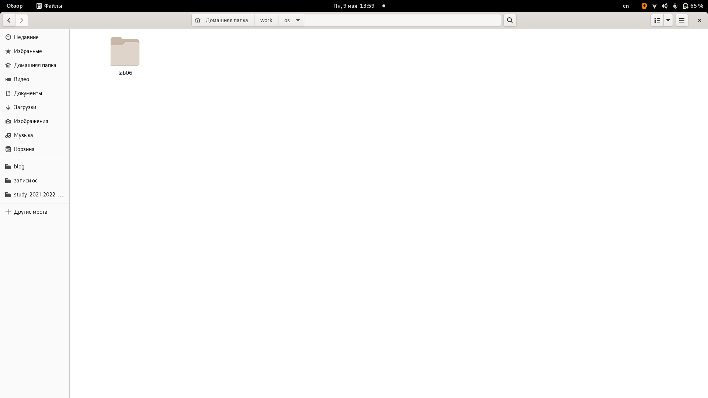{ #fig:001 width=70% }

**2.**Перешел в созданный каталог, вызвал vi и создал файл *hello.sh*. (рис. [-@fig:002])

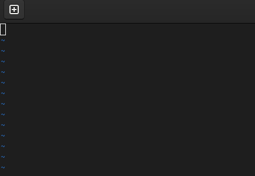{ #fig:002 width=70% }

**3.** Ввел необходимый текст.(рис. [-@fig:003])

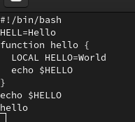{ #fig:003 width=70% }

**4.** Перешел в командном режиме на последнюю строку и завершил работу *vi*, сохранив все изменения.(рис. [-@fig:004])

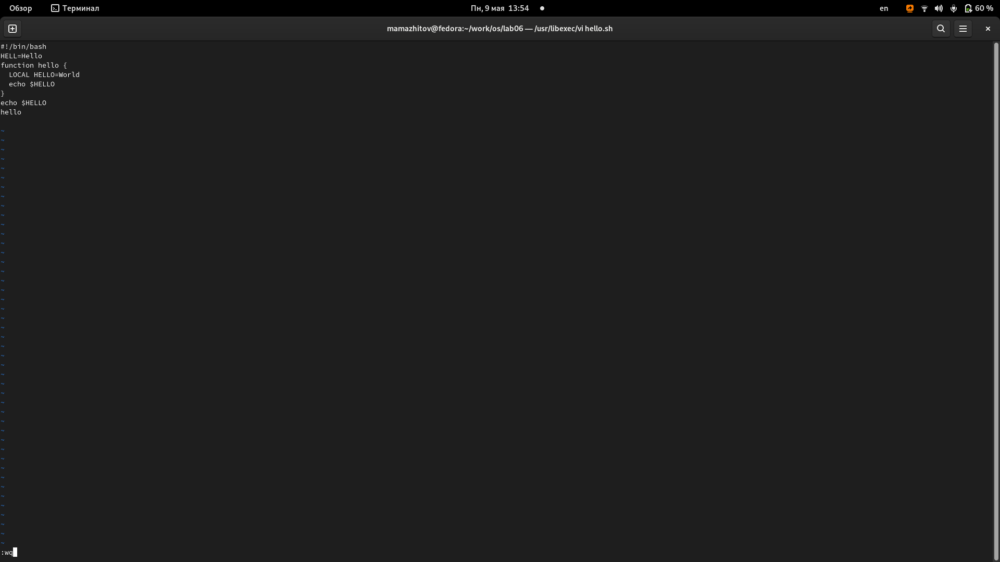{ #fig:004 width=70% }

**5.** Сделал файл исполняемым.(рис. [-@fig:005])

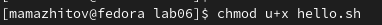{ #fig:005 width=70% }

**6.** Вызвал редактор *vi*. (рис. [-@fig:006])

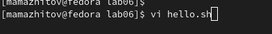{ #fig:006 width=70% }

**7.** Установил курсор в конец слова HELL второй строки, перешел в режим вставки и дописал в конце слова букву *О*(рис. [-@fig:007])

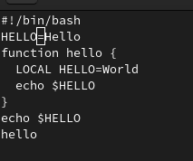{ #fig:007 width=70% }

**8.** Перешел на четвертую строку и стер слово *LOCAL*.(рис. [-@fig:008])

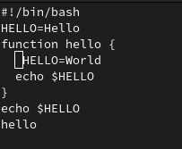{ #fig:008 width=70% }

**9.** Перешел в режим вставки и набрал слово *local*.(рис. [-@fig:009])

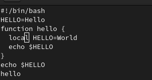{ #fig:009 width=70% }

**10.** Перешел в конец файла и вставил *echo $HELLO*. (рис. [-@fig:010])

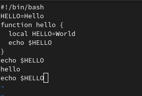{ #fig:010 width=70% }

**11.** Перешел в командный режим и удалил последнюю строку.(рис. [-@fig:011])

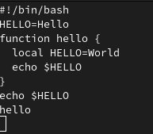{ #fig:011 width=70% }

**12.** Отменил последнее действие. (рис. [-@fig:012])

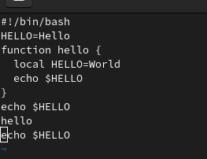{ #fig:012 width=70% }

**13.** Закрыл редактор, сохранив все изменения. (рис. [-@fig:013])

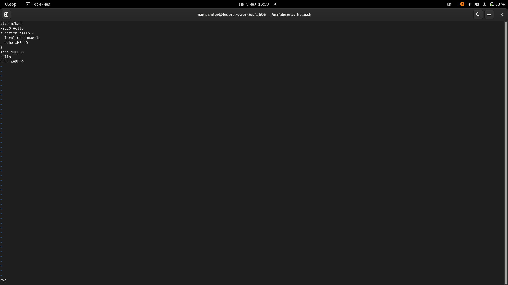{ #fig:013 width=70% }

# Вывод

Мы получили базовые навыки использования vi.

# Контрольные вопросы.

1. Редактор vi имеет три режима работы:
– командный режим — предназначен для ввода команд редактирования и навигации по
редактируемому файлу;
– режим вставки — предназначен для ввода содержания редактируемого файла;
– режим последней (или командной) строки — используется для записи изменений в файл
и выхода из редактора.

2. Набрать символ q (или q!), если требуется выйти из редактора без сохранения

3. Команды позиционирования
- 0 (ноль) — переход в начало строки;
- $ — переход в конец строки;
- G — переход в конец файла;
- nG — переход на строку с номером 𝑛.

4. При использовании прописных W и B под разделителями понимаются только пробел, табуляция и возврат
каретки. При использовании строчных w и b под разделителями понимаются также любые знаки пунктуации.

5. Для того, чтобы переместить курсор в начало файла, можно использовать команду 1G. Для перехода в конец файла необходимо нажать G.

6. Команды редактирования: вставка текста, вставка строки, удаление текста, отмена и повтор произведённых изменений, копирование текста в буфер, вставка текста из буфера, замена текста, поиск текста.

7. Перейду в режим вставки и введу необходимое количество *$*.

8. Отменить последнее действие с помощью команды *u*.

9. Команды редактирования в режиме командной строки: копирование и перемещение текста, запись в файл и выход из редактора

10. Необходимо перейти в конец строки с помощью *$*.

11. Опции
Опции редактора vi позволяют настроить рабочую среду. Для задания опций используется команда set (в режиме последней строки):
- : set all — вывести полный список опций;
- : set nu — вывести номера строк;
- : set list — вывести невидимые символы;
- : set ic — не учитывать при поиске, является ли символ прописным или строчным.
Если вы хотите отказаться от использования опции, то в команде set перед именем
опции надо поставить no.

12. Если в нижнем углу выводиться *Insert* - мы находимся в режиме вставки.
  Если курсор находится в конце файла и можно увидеть там двоеточие - режим последней (или командной) строки
  В ином случаи - мы находимся в командном режиме

13.   Командный режим.
        - режим вставки.
        - режим последней строки.