---
## Front matter
lang: ru-RU
title: Лабораторная работы №9 "Текстовой редактор emacs"
author: Тулеуов Мади
institute: RUDN University, Moscow, Russian Federation
date:

## Formatting
mainfont: PT Serif
romanfont: PT Serif
sansfont: PT Sans
monofont: PT Mono
toc: false
slide_level: 2
theme: metropolis
header-includes: 
 - \metroset{progressbar=frametitle,sectionpage=progressbar,numbering=fraction}
 - '\makeatletter'
 - '\beamer@ignorenonframefalse'
 - '\makeatother'
aspectratio: 43
section-titles: true
---

## Цель работы:

Познакомиться с операционной системой Linux. Получить практические навыки работы с редактором Emacs.

---

## Задачи

1. Открыть emacs.
2. Создать файл lab07.sh с помощью комбинации Ctrl-x Ctrl-f (C-x C-f).
3. Набрать, приведенный в документе, текст.
4. Сохранить файл с помощью комбинации Ctrl-x Ctrl-s (C-x C-s).

---

## Задачи

5. Проделать с текстом стандартные процедуры редактирования, каждое действие должно осуществляться комбинацией клавиш.
      1. Вырезать одной командой целую строку (С-k).
      2. Вставить эту строку в конец файла (C-y).
      3. Выделить область текста (C-space).
      4. Скопировать область в буфер обмена (M-w).
      5. Вставить область в конец файла.
      6. Вновь выделить эту область и на этот раз вырезать её (C-w).
      7. Отмените последнее действие (C-/).

---

## Задачи

7. Управление буферами.
      1. Вывести список активных буферов на экран (C-x C-b).
      2. Переместиться во вновь открытое окно (C-x) o со списком открытых буферов и переключитесь на другой буфер.
      3. Закрыть это окно (C-x 0).
      4. Теперь вновь переключиться между буферами, но уже без вывода их списка на
      экран (C-x b).

---

## Задачи

8. Управление окнами.
      1. Поделить фрейм на 4 части: разделить фрейм на два окна по вертикали (C-x 3), а затем каждое из этих окон на две части по горизонтали (C-x 2)
      2. В каждом из четырёх созданных окон открыть новый буфер (файл) и ввести несколько строк текста.

---

## Задачи

9. Режим поиска
      1. Переключиться в режим поиска (C-s) и найти несколько слов, присутствующих
      в тексте.
      2. Переключитесь между результатами поиска, нажимая C-s.
      3. Выйти из режима поиска, нажав C-g.
      4. Перейти в режим поиска и замены (M-%), ввести текст, который следует найти
      и заменить, нажмите Enter , затем ввести текст для замены. После того как будут
    подсвечены результаты поиска, нажать ! для подтверждения замены.

---

## Задачи
5. Испробовать другой режим поиска, нажав M-s o. Объяснить, чем он отличается от
 обычного режима?

## Ход работы

Открыл emacs. (рис. [-@fig:001])

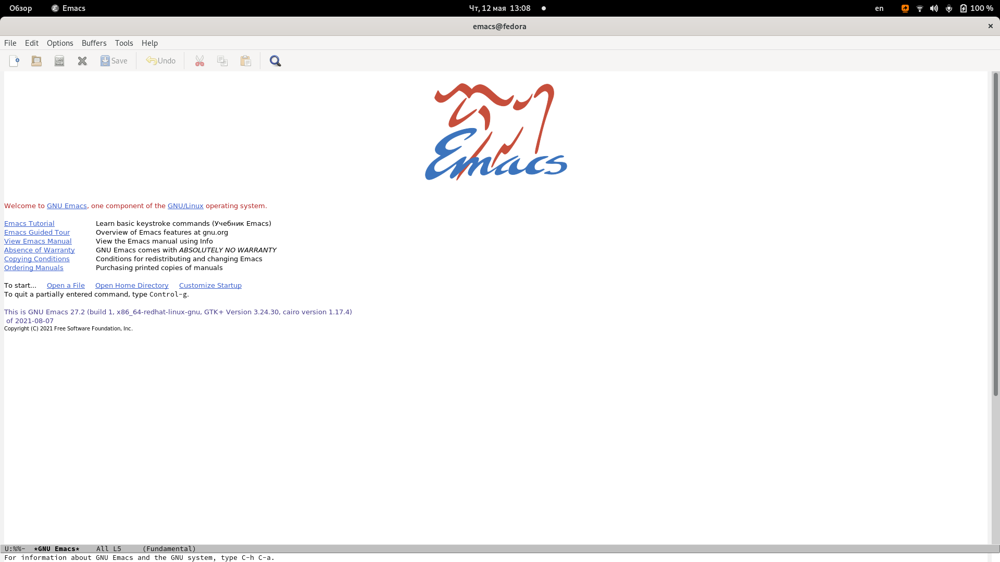{ #fig:001 width=70% }

---

## Ход работы

Создал файл lab07.sh с помощью комбинации Ctrl-x Ctrl-f. Затем я ввел, приведенный в документе, текст.(рис. [-@fig:002])

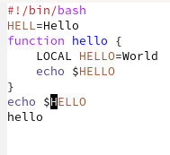{ #fig:002 width=70% }

---

## Ход работы

Cохранил файл.(рис. [-@fig:003])

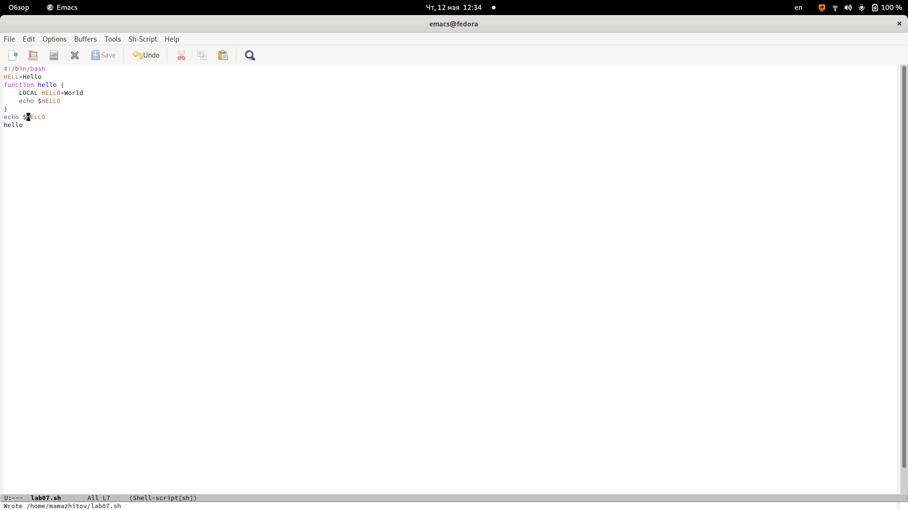{ #fig:003 width=70% }

---

## Ход работы
 
Вырезал одной командой целую строку.(рис. [-@fig:004])

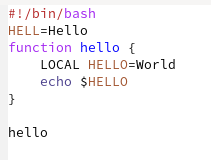{ #fig:004 width=70% }

---

## Ход работы

Вставил эту строку в конец файла.(рис. [-@fig:005])

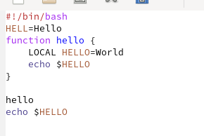{ #fig:005 width=70% }

---

## Ход работы

Выделил область текста, скопировал область в буфер обмена и вставил его в конец файла. (рис. [-@fig:006])

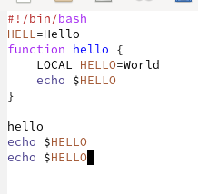{ #fig:006 width=70% }

---

## Ход работы

Вновь выделил эту область и вырезал ее.(рис. [-@fig:007])

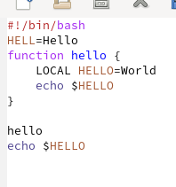{ #fig:007 width=70% }

---

## Ход работы

Отменил последнее действие.(рис. [-@fig:008])

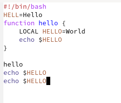{ #fig:008 width=70% }

---

## Ход работы

Переместил курсор в начало строки (С-а).(рис. [-@fig:009])

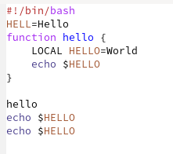{ #fig:009 width=70% }

---

## Ход работы

Переместил курсор в конец строки. (рис. [-@fig:010])

{ #fig:010 width=70% }

---

## Ход работы

Переместил курсор в начало буфера, а затем в конец буфера.

---

## Ход работы

Вывел список активных буферов на экран.(рис. [-@fig:011])

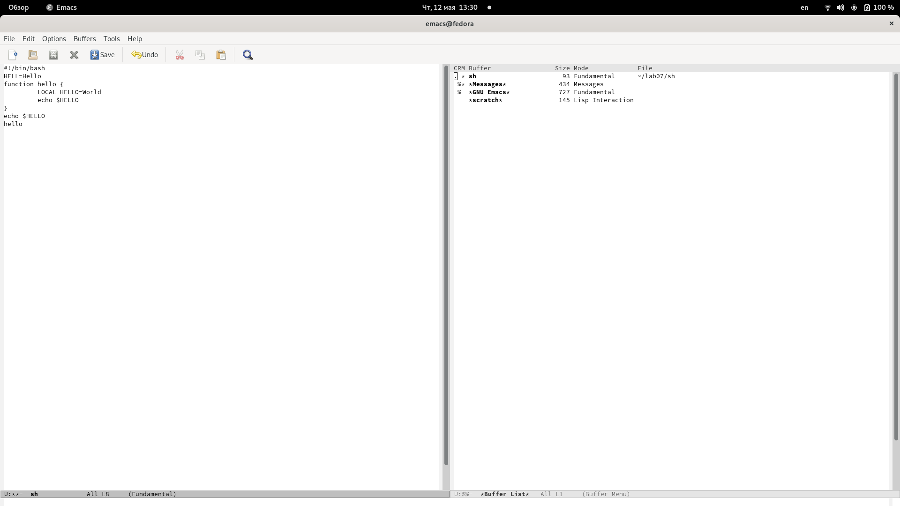{ #fig:011 width=70% }

---

## Ход работы

Переместился во вновь открытое окно со списком открытых буферов и переключился на другой буфер. (рис. [-@fig:012])

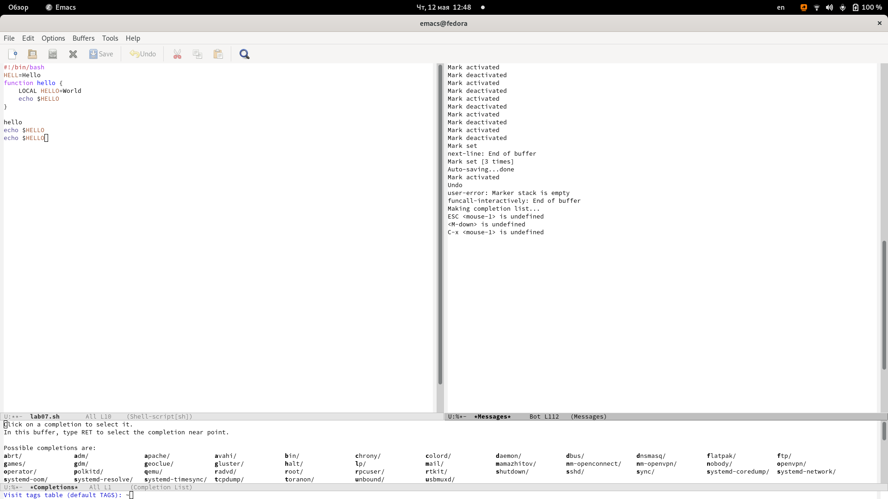{ #fig:012 width=70% }

---

## Ход работы

Закрыл это окно. (рис. [-@fig:013])

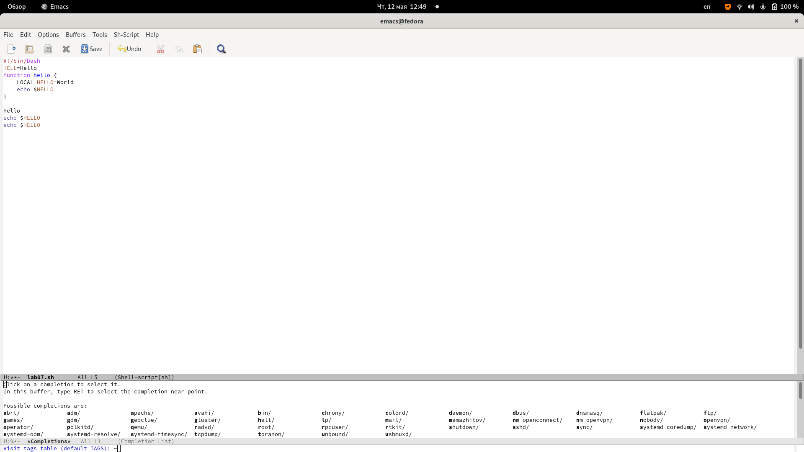{ #fig:013 width=70% }

---

## Ход работы

Переключился на другой буфер, но уже без вывода их списка на экран.(рис. [-@fig:014])

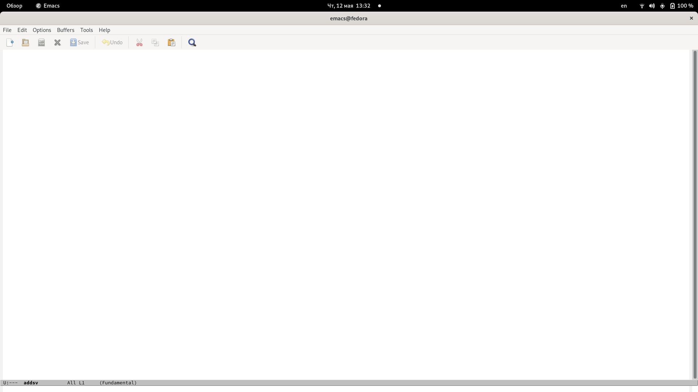{ #fig:014 width=70% }

---

## Ход работы

Поделил фрейм на 4 части: разделил фрейм на два окна по вертикали, а затем каждое из этих окон на две части по горизонтали.(рис. [-@fig:015])

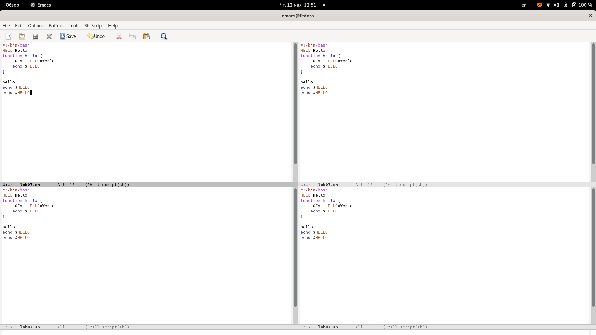{ #fig:015 width=70% }

---

## Ход работы

В каждом из четырёх созданных окон открыл новый буфер (файл) и ввел рандомные буквы.(рис. [-@fig:016])

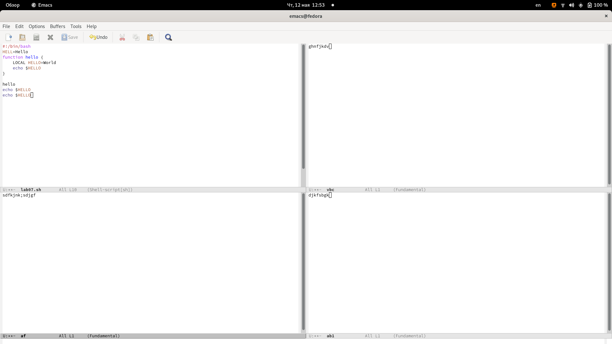{ #fig:016 width=70% }

---

## Ход работы

Переключился в режим поиска и нашел слово *hello*.(рис. [-@fig:017])

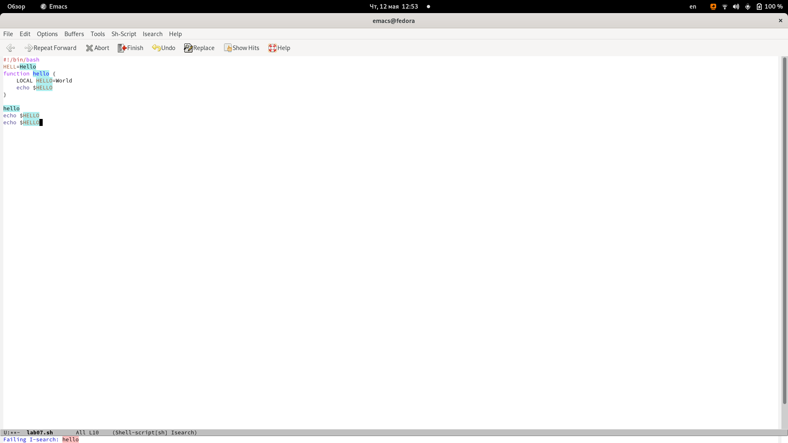{ #fig:017 width=70% }

---

## Ход работы

Переключился между результатами поиска. (рис. [-@fig:018])

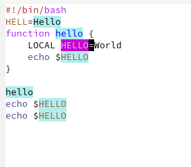{ #fig:018 width=70% }

---

## Ход работы

Испробовал другой режим поиска, нажав M-s o. (рис. [-@fig:019])

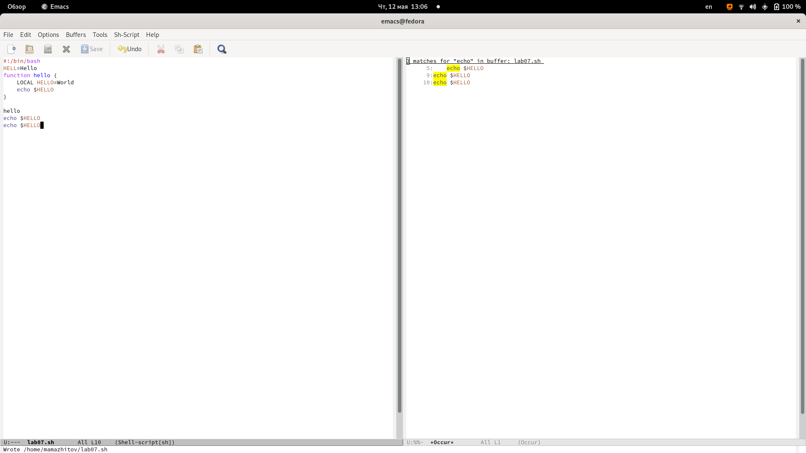{ #fig:019 width=70% }

---

## Вывод

Мы получили базовые навыки использования emacs.