---
## Front matter
title: "Лабораторная работа №9"
subtitle: "Текстовой редактор emacs"
author: "Мажитов Магомед Асхабович"

## Generic otions
lang: ru-RU
toc-title: "Содержание"

## Bibliography
bibliography: bib/cite.bib
csl: pandoc/csl/gost-r-7-0-5-2008-numeric.csl

## Pdf output format
toc: true # Table of contents
toc-depth: 2
lof: true # List of figures
lot: true # List of tables
fontsize: 12pt
linestretch: 1.5
papersize: a4
documentclass: scrreprt
## I18n polyglossia
polyglossia-lang:
  name: russian
  options:
	- spelling=modern
	- babelshorthands=true
polyglossia-otherlangs:
  name: english
## I18n babel
babel-lang: russian
babel-otherlangs: english
## Fonts
mainfont: PT Serif
romanfont: PT Serif
sansfont: PT Sans
monofont: PT Mono
mainfontoptions: Ligatures=TeX
romanfontoptions: Ligatures=TeX
sansfontoptions: Ligatures=TeX,Scale=MatchLowercase
monofontoptions: Scale=MatchLowercase,Scale=0.9
## Biblatex
biblatex: true
biblio-style: "gost-numeric"
biblatexoptions:
  - parentracker=true
  - backend=biber
  - hyperref=auto
  - language=auto
  - autolang=other*
  - citestyle=gost-numeric
## Pandoc-crossref LaTeX customization
figureTitle: "Рис."
tableTitle: "Таблица"
listingTitle: "Листинг"
lofTitle: "Список иллюстраций"
lotTitle: "Список таблиц"
lolTitle: "Листинги"
## Misc options
indent: true
header-includes:
  - \usepackage{indentfirst}
  - \usepackage{float} # keep figures where there are in the text
  - \floatplacement{figure}{H} # keep figures where there are in the text
---

# Цель работы

Познакомиться с операционной системой Linux. Получить практические навыки работы с редактором Emacs.

# Задачи

1. Открыть emacs.
2. Создать файл lab07.sh с помощью комбинации Ctrl-x Ctrl-f (C-x C-f).
3. Набрать, приведенный в документе, текст.
4. Сохранить файл с помощью комбинации Ctrl-x Ctrl-s (C-x C-s).
5. Проделать с текстом стандартные процедуры редактирования, каждое действие должно осуществляться комбинацией клавиш.
      1. Вырезать одной командой целую строку (С-k).
      2. Вставить эту строку в конец файла (C-y).
      3. Выделить область текста (C-space).
      4. Скопировать область в буфер обмена (M-w).
      5. Вставить область в конец файла.
      6. Вновь выделить эту область и на этот раз вырезать её (C-w).
      7. Отмените последнее действие (C-/).
6. Научится использовать команды по перемещению курсора.
      1. Переместить курсор в начало строки (C-a).
      2. Переместить курсор в конец строки (C-e).
      3. Переместить курсор в начало буфера (M-<).
      4. Переместить курсор в конец буфера (M->).
7. Управление буферами.
      1. Вывести список активных буферов на экран (C-x C-b).
      2. Переместиться во вновь открытое окно (C-x) o со списком открытых буферов и переключитесь на другой буфер.
      3. Закрыть это окно (C-x 0).
      4. Теперь вновь переключиться между буферами, но уже без вывода их списка на
      экран (C-x b).
8. Управление окнами.
      1. Поделить фрейм на 4 части: разделить фрейм на два окна по вертикали (C-x 3), а затем каждое из этих окон на две части по горизонтали (C-x 2)
      2. В каждом из четырёх созданных окон открыть новый буфер (файл) и ввести несколько строк текста.
9. Режим поиска
      1. Переключиться в режим поиска (C-s) и найти несколько слов, присутствующих
      в тексте.
      2. Переключитесь между результатами поиска, нажимая C-s.
      3. Выйти из режима поиска, нажав C-g.
      4. Перейти в режим поиска и замены (M-%), ввести текст, который следует найти
      и заменить, нажмите Enter , затем ввести текст для замены. После того как будут
    подсвечены результаты поиска, нажать ! для подтверждения замены.
      5. Испробовать другой режим поиска, нажав M-s o. Объяснить, чем он отличается от
    обычного режима?

# Ход работы

**1.** Открыл emacs. (рис. [-@fig:001])

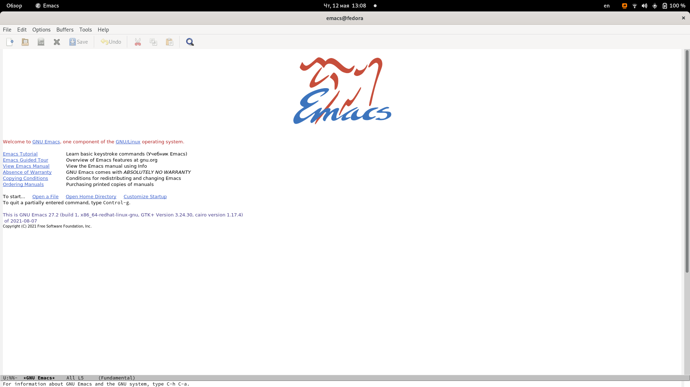{ #fig:001 width=70% }

**2.** Создал файл lab07.sh с помощью комбинации Ctrl-x Ctrl-f. Затем я ввел, приведенный в документе, текст.(рис. [-@fig:002])

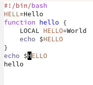{ #fig:002 width=70% }

**3.** Сохранил файл.(рис. [-@fig:003])

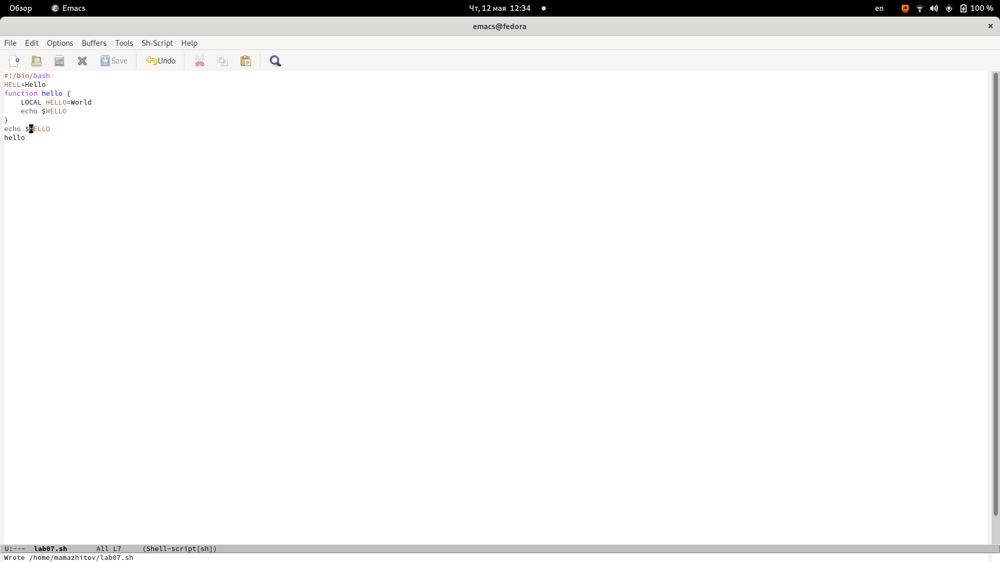{ #fig:003 width=70% }

**4.** Вырезал одной командой целую строку.(рис. [-@fig:004])

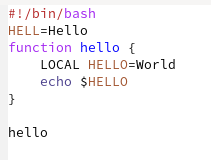{ #fig:004 width=70% }

**5.** Вставил эту строку в конец файла.(рис. [-@fig:005])

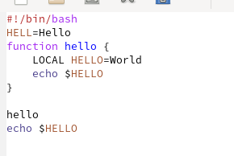{ #fig:005 width=70% }

**6.** Выделил область текста, скопировал область в буфер обмена и вставил его в конец файла. (рис. [-@fig:006])

{ #fig:006 width=70% }

**7.** Вновь выделил эту область и вырезал ее.(рис. [-@fig:007])

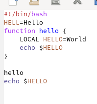{ #fig:007 width=70% }

**8.** Отменил последнее действие.(рис. [-@fig:008])

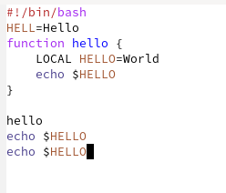{ #fig:008 width=70% }

**9.** Переместил курсор в начало строки (С-а).(рис. [-@fig:009])

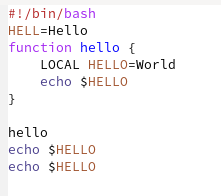{ #fig:009 width=70% }

**10.** Переместил курсор в конец строки. (рис. [-@fig:010])

{ #fig:010 width=70% }

**11.** Переместил курсор в начало буфера.

**12.** Переместил курсор в конец буфера.

**13.** Вывел список активных буферов на экран.(рис. [-@fig:011])

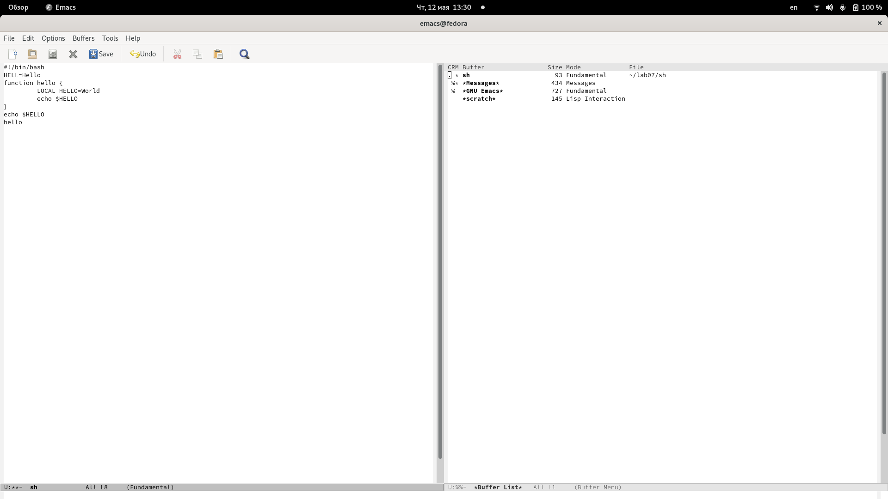{ #fig:011 width=70% }

**14.** Переместился во вновь открытое окно со списком открытых буферов и переключился на другой буфер. (рис. [-@fig:012])

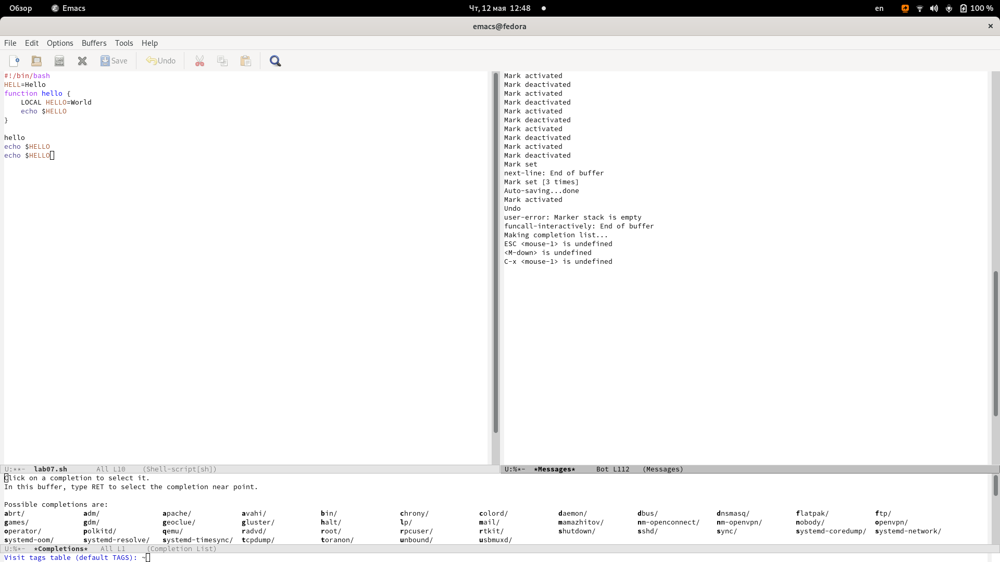{ #fig:012 width=70% }

**15.** Закрыл это окно. (рис. [-@fig:013])

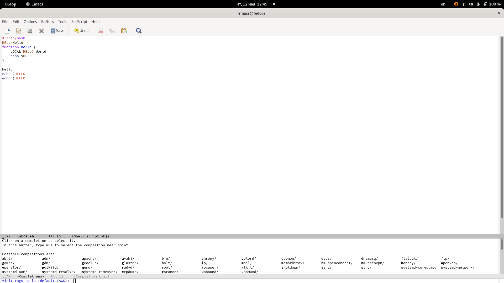{ #fig:013 width=70% }

**16.**  Переключился на другой буфер, но уже без вывода их списка на экран.(рис. [-@fig:014])

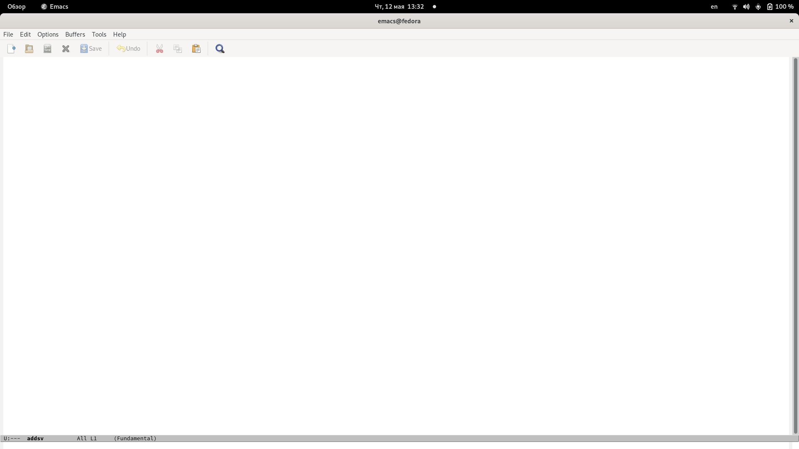{ #fig:014 width=70% }

**17.** Поделил фрейм на 4 части: разделил фрейм на два окна по вертикали, а затем каждое из этих окон на две части по горизонтали.(рис. [-@fig:015])

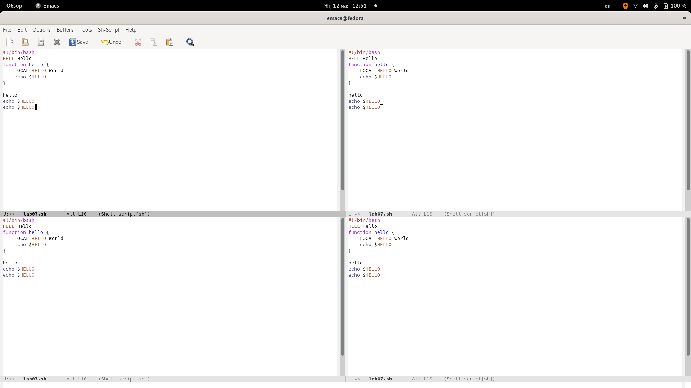{ #fig:015 width=70% }

**18.** В каждом из четырёх созданных окон открыл новый буфер (файл) и ввел рандомные буквы.(рис. [-@fig:016])

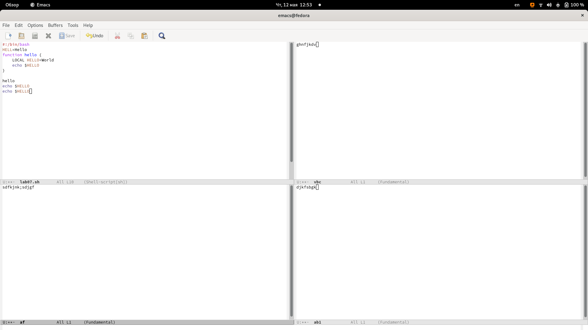{ #fig:016 width=70% }

**19.** Переключился в режим поиска и нашел слово *hello*.(рис. [-@fig:017])

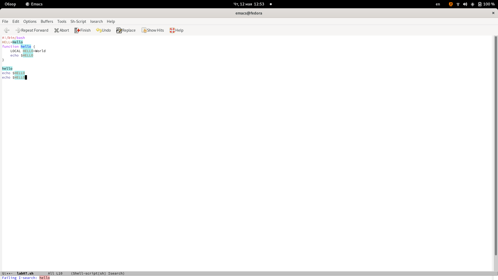{ #fig:017 width=70% }

**20.** Переключился между результатами поиска. (рис. [-@fig:018])

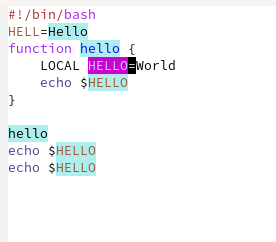{ #fig:018 width=70% }

**21.** Испробовал другой режим поиска, нажав M-s o. (рис. [-@fig:019])

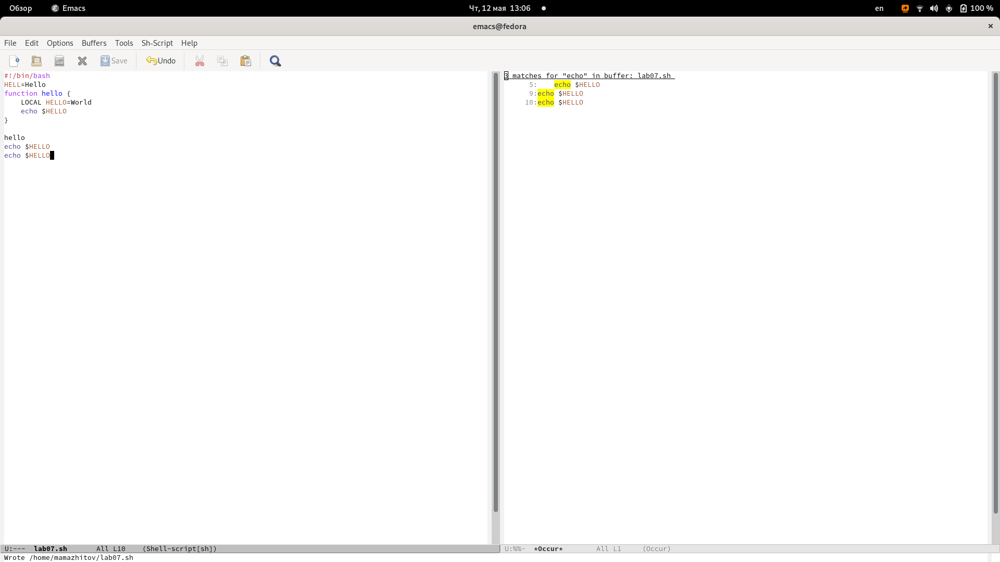{ #fig:019 width=70% }

# Вывод

Мы получили базовые навыки использования emacs.

# Контрольные вопросы.

1. Emacs представляет собой мощный экранный редактор текста, написанный на языке
высокого уровня Elisp.

2. Многие рутинные операции в Emacs удобнее производить с помощью клавиатуры, а не
графического меню. Наиболее часто в командах Emacs используются сочетания c клавишами Ctrl и Meta (в обозначениях Emacs: C- и M-; клавиша Shift в Emasc обозначается
как S-). Так как на клавиатуре для IBM PC совместимых ПК клавиши Meta нет, то вместо
неё можно использовать Alt или Esc.

3. Если своими словами, то буфер - это файл, содержащий какой-либо текст. Окно же можно сказать область, где вы водится текст определенного буфера.

4. Можно открыть больше 10 буферов в одном окне.

5. Только что запущенный Emacs несет один буфер с именем `*scratch*', который может быть использован для вычисления выражений Лиспа в Emacs.

6. Ctrl-c |(первые две нажму вместе, а третью отдельно), Ctrl-c Ctrl-|(каждую пару нажму раздельно).

7. Разделить фрейм на два окна по вертикали (C-x 3),а по горизонтали (C-x 2) .

8. В файле Emacs хранятся настройки редактора.

9. Кнопка BACKSPACE = функции C-k и ее можно переназначить.

10. Редактор Emacs мне показался удобнее, так как в нем больше возможностей по сравнению с vi.