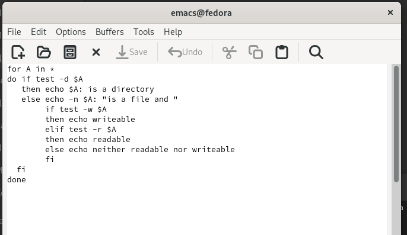

---
## Front matter
lang: ru-RU
title: Лабораторная работы №10 "Программирование в командном процессоре ОС UNIX. Командные файлы"
author: Тулеуов Мади
institute: RUDN University, Moscow, Russian Federation
date:

## Formatting
mainfont: PT Serif
romanfont: PT Serif
sansfont: PT Sans
monofont: PT Mono
toc: false
slide_level: 2
theme: metropolis
header-includes: 
 - \metroset{progressbar=frametitle,sectionpage=progressbar,numbering=fraction}
 - '\makeatletter'
 - '\beamer@ignorenonframefalse'
 - '\makeatother'
aspectratio: 43
section-titles: true
---

## Цель работы:

Изучить основы программирования в оболочке ОС UNIX/Linux. Научиться писать небольшие командные файлы.

---

## Задачи

1. Написать скрипт, который при запуске будет делать резервную копию самого себя (то есть файла, в котором содержится его исходный код) в другую директорию backup в вашем домашнем каталоге. При этом файл должен архивироваться одним из архиваторов на выбор zip, bzip2 или tar. Способ использования команд архивации необходимо узнать, изучив справку.

---

## Задачи

2. Написать пример командного файла, обрабатывающего любое произвольное число аргументов командной строки, в том числе превышающее десять. Например, скрипт может последовательно распечатывать значения всех переданных аргументов.

---

## Задачи

3. Написать командный файл — аналог команды ls (без использования самой этой команды и команды dir). Требуется, чтобы он выдавал информацию о нужном каталоге и выводил информацию о возможностях доступа к файлам этого каталога.

---

## Задачи

4. Написать командный файл, который получает в качестве аргумента командной строки формат файла (.txt, .doc, .jpg, .pdf и т.д.) и вычисляет количество таких файлов в указанной директории. Путь к директории также передаётся в виде аргумента командной строки.

---

## Ход работы

Открыл в emacs файл *script1* и написал код, который создает архив, содержащий сам файл, и перемещает его в папку *backup*. (рис. [-@fig:001])

{ #fig:001 width=70% }

---

## Ход работы

Запустил скрипт. (рис. [-@fig:002])

{ #fig:002 width=70% }

---

## Ход работы
 
Проверил его работу. (рис. [-@fig:003])

{ #fig:003 width=70% }

---

## Ход работы

Открыл в emacs файл *script2*, написал цикл *for*, который последовательно выводит значения всех переданных аргументов.(рис. [-@fig:004])

{ #fig:004 width=70% }

---

## Ход работы

Запустил скрипт.(рис. [-@fig:005])

{ #fig:005 width=70% }

---

## Ход работы

Открыл в emacs файл *script3* и скопировал программу из теории к лабораторной работы.(рис. [-@fig:006])

{ #fig:006 width=70% }

---

## Ход работы

Проверил его работу.(рис. [-@fig:007])

{ #fig:007 width=70% }

---

## Ход работы

Открыл в emacs файл *script4*. Написал программу, которая просит ввести путь к директории и формат файла, а затем выводит количество файлов с данным форматом в данной директории.(рис. [-@fig:008])

{ #fig:008 width=70% }

---

## Ход работы

Проверил работу скрипта. (рис. [-@fig:009])

{ #fig:009 width=70% }

---

## Вывод

Мы научились писать небольшие командные файлы.