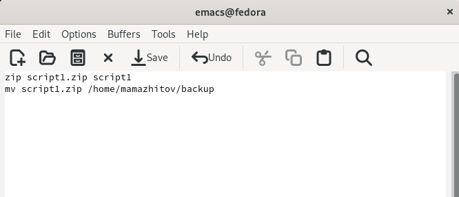
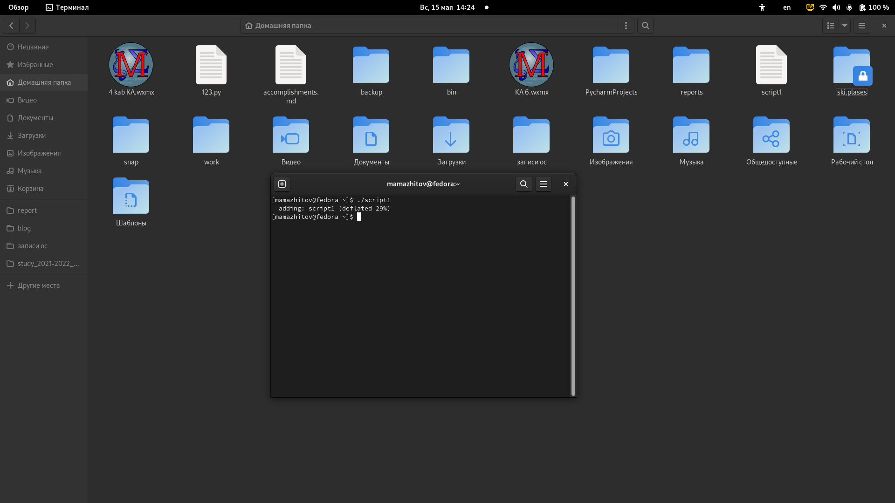
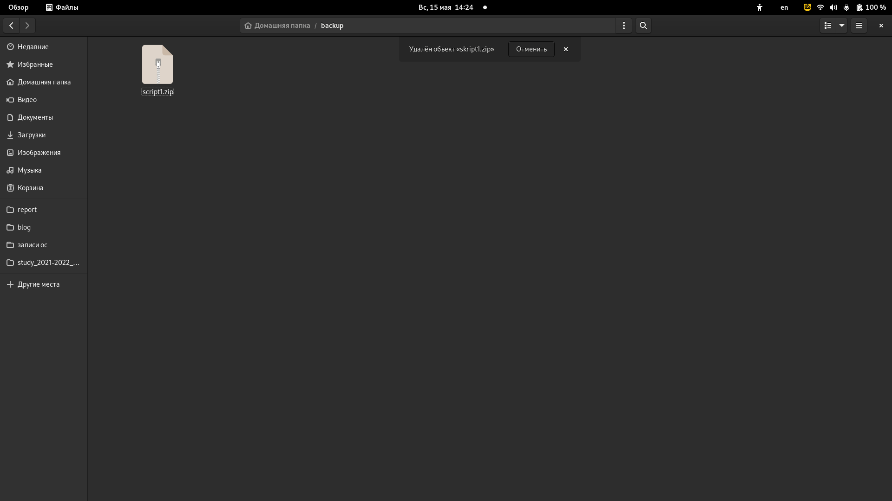
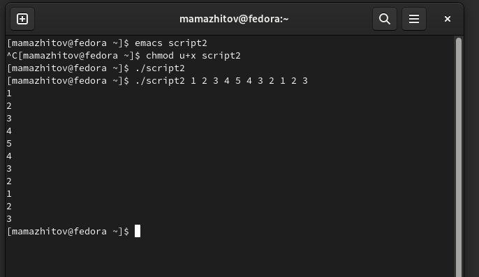
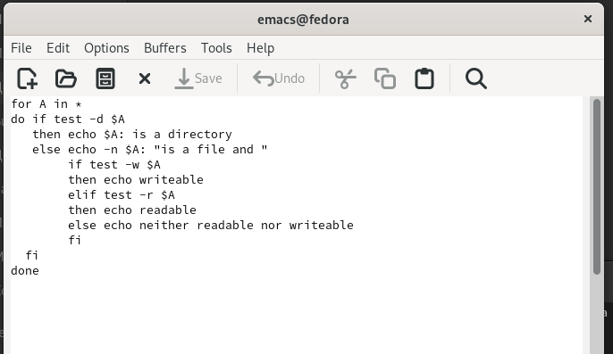
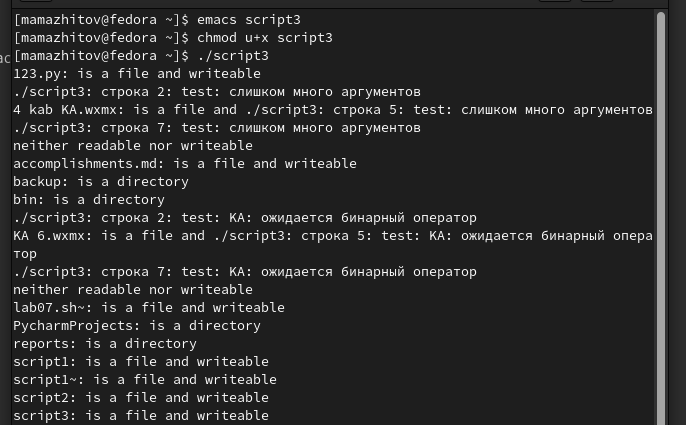
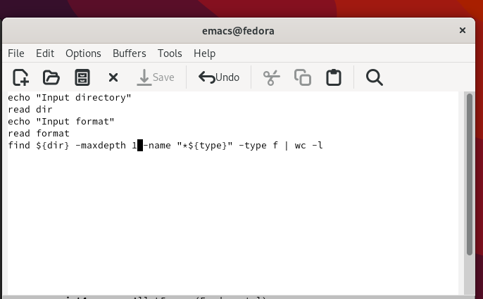
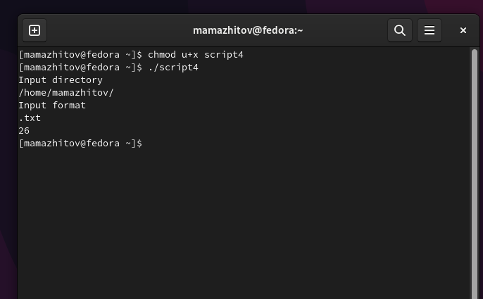

---
## Front matter
title: "Лабораторная работа №10"
subtitle: "Программирование в командном процессоре ОС UNIX. Командные файлы"
author: "Тулеуов Мади"

## Generic otions
lang: ru-RU
toc-title: "Содержание"

## Bibliography
bibliography: bib/cite.bib
csl: pandoc/csl/gost-r-7-0-5-2008-numeric.csl

## Pdf output format
toc: true # Table of contents
toc-depth: 2
lof: true # List of figures
lot: true # List of tables
fontsize: 12pt
linestretch: 1.5
papersize: a4
documentclass: scrreprt
## I18n polyglossia
polyglossia-lang:
  name: russian
  options:
	- spelling=modern
	- babelshorthands=true
polyglossia-otherlangs:
  name: english
## I18n babel
babel-lang: russian
babel-otherlangs: english
## Fonts
mainfont: PT Serif
romanfont: PT Serif
sansfont: PT Sans
monofont: PT Mono
mainfontoptions: Ligatures=TeX
romanfontoptions: Ligatures=TeX
sansfontoptions: Ligatures=TeX,Scale=MatchLowercase
monofontoptions: Scale=MatchLowercase,Scale=0.9
## Biblatex
biblatex: true
biblio-style: "gost-numeric"
biblatexoptions:
  - parentracker=true
  - backend=biber
  - hyperref=auto
  - language=auto
  - autolang=other*
  - citestyle=gost-numeric
## Pandoc-crossref LaTeX customization
figureTitle: "Рис."
tableTitle: "Таблица"
listingTitle: "Листинг"
lofTitle: "Список иллюстраций"
lotTitle: "Список таблиц"
lolTitle: "Листинги"
## Misc options
indent: true
header-includes:
  - \usepackage{indentfirst}
  - \usepackage{float} # keep figures where there are in the text
  - \floatplacement{figure}{H} # keep figures where there are in the text
---

# Цель работы

Изучить основы программирования в оболочке ОС UNIX/Linux. Научиться писать небольшие командные файлы.

# Задачи

1. Написать скрипт, который при запуске будет делать резервную копию самого себя (то есть файла, в котором содержится его исходный код) в другую директорию backup в вашем домашнем каталоге. При этом файл должен архивироваться одним из архиваторов на выбор zip, bzip2 или tar. Способ использования команд архивации необходимо узнать, изучив справку.
2. Написать пример командного файла, обрабатывающего любое произвольное число аргументов командной строки, в том числе превышающее десять. Например, скрипт может последовательно распечатывать значения всех переданных аргументов.
3. Написать командный файл — аналог команды ls (без использования самой этой команды и команды dir). Требуется, чтобы он выдавал информацию о нужном каталоге и выводил информацию о возможностях доступа к файлам этого каталога.
4. Написать командный файл, который получает в качестве аргумента командной строки формат файла (.txt, .doc, .jpg, .pdf и т.д.) и вычисляет количество таких файлов в указанной директории. Путь к директории также передаётся в виде аргумента командной строки.

# Ход работы

**1.** Открыл в emacs файл *script1* и написал код, который создает архив, содержащий сам файл, и перемещает его в папку *backup*. (рис. [-@fig:001])

{ #fig:001 width=70% }

Запустил скрипт. (рис. [-@fig:002])

{ #fig:002 width=70% }

Проверка. (рис. [-@fig:003])

{ #fig:003 width=70% }

**2.** Открыл в emacs файл *script2*, написал цикл *for*, который последовательно выводит значения всех переданных аргументов.(рис. [-@fig:004])

{ #fig:004 width=70% }

Запустил скрипт.(рис. [-@fig:005])

{ #fig:005 width=70% }

**3.** Открыл в emacs файл *script3* и скопировал программу из теории к лабораторной работы.(рис. [-@fig:006])

{ #fig:006 width=70% }

Проверил его работу.(рис. [-@fig:007])

{ #fig:007 width=70% }

**4.** Открыл в emacs файл *script4*. Написал программу, которая просит ввести путь к директории и формат файла, а затем выводит количество файлов с данным форматом в данной директории.(рис. [-@fig:008])

{ #fig:008 width=70% }

Проверил работу скрипта. (рис. [-@fig:009])

{ #fig:009 width=70% }

# Вывод

Мы научились писать небольшие командные файлы.

# Контрольные вопросы.

1. Командный процессор (командная оболочка, интерпретатор команд shell) — это программа, позволяющая пользователю взаимодействовать с операционной системой
компьютера. В операционных системах типа UNIX/Linux наиболее часто используются
следующие реализации командных оболочек:
- оболочка Борна (Bourne shell или sh) — стандартная командная оболочка UNIX/Linux,
содержащая базовый, но при этом полный набор функций;
- С-оболочка (или csh) — надстройка на оболочкой Борна, использующая С-подобный
синтаксис команд с возможностью сохранения истории выполнения команд;
- оболочка Корна (или ksh) — напоминает оболочку С, но операторы управления программой совместимы с операторами оболочки Борна;
- BASH — сокращение от Bourne Again Shell (опять оболочка Борна), в основе своей совмещает свойства оболочек С и Корна (разработка компании Free Software Foundation).

2. POSIX (Portable Operating System Interface for Computer Environments) — набор стандартов
описания интерфейсов взаимодействия операционной системы и прикладных программ.

3. ``mark=/usr/andy/bin``

    Данная команда присваивает значение строки символов /usr/andy/bin переменной mark типа строкасимволов.

    Для создания массива используется команда set с флагом -A. За флагом следует имя переменной, а затем список значений, разделённых пробелами. Например,
    
    ``set -A states Delaware Michigan "New Jersey"``

4. Команда let является показателем того, что последующие аргументы представляют собой выражение, подлежащее вычислению. Команда read позволяет читать значения переменных со стандартного ввода

5. Простейшими математическими выражениями являются сложение (+), вычитание (-), умножение (*), целочисленное деление (/) и целочисленный остаток от деления (%).

6. Для облегчения программирования можно записывать условия оболочки bash в двойные
скобки — (( )).

7. Переменные PS1 и PS2 предназначены для отображения промптера командного процессора. PS1 — это промптер командного процессора, по умолчанию его значение равно символу $ или #. Если какая-то интерактивная программа, запущенная командным процессором, требует ввода, то используется промптер PS2. Он по умолчанию имеет значение символа >.
Другие стандартные переменные:
- HOME — имя домашнего каталога пользователя. Если команда cd вводится без аргументов, то происходит переход в каталог, указанный в этой переменной.
- IFS — последовательность символов, являющихся разделителями в командной строке,например, пробел, табуляция и перевод строки (new line).
- MAIL — командный процессор каждый раз перед выводом на экран промптера проверяет содержимое файла, имя которого указано в этой переменной, и если содержимое этого файла изменилось с момента последнего ввода из него, то перед тем как вывести на терминал промптер, командный процессор выводит на терминал сообщение You have mail (у Вас есть почта).
- TERM — тип используемого терминала.
- LOGNAME — содержит регистрационное имя пользователя, которое устанавливается автоматически при входе в систему.

8. Такие символы, как ' < > * ? | \ " &, являются метасимволами и имеют для командного процессора специальный смысл

9. Снятие специального смысла с метасимвола называется экранированием метасимвола. Экранирование может быть осуществлено с помощью предшествующего метасимволу символа \, который, в свою очередь, является метасимволом.

10. Командный файл можно создать с помощьб какого-либо редактора, затем сделать его исполняемым и запустить его из терминала, введя "./название файла".

11.  помощью ключевого слова *function*.

12. Вводим команду *ls -lrt* и если первым в правах доступа стоит *d* то это каталог. Иначе это файл.

13. Для создания массива используется команда set с флагом -A. Если использовать typeset -i для объявления и присвоения переменной, то при последующем её применении она станет целой. Изъять переменную из программы можно с помощью команды unset.

14. При вызове командного файла на выполнение параметры ему могут быть переданы точно таким же образом, как и выполняемой программе. С точки зрения командного файла эти параметры являются позиционными. Символ $ является метасимволом командного процессора. Он используется, в частности, для ссылки на параметры, точнее, для получения их значений в командном файле. В командный файл можно передать до девяти параметров.

15. 
- ``$*`` — отображается вся командная строка или параметры оболочки;
- ``$?`` — код завершения последней выполненной команды;
- ``$$`` — уникальный идентификатор процесса, в рамках которого выполняется командный процессор;
- ``$!`` — номер процесса, в рамках которого выполняется последняя вызванная на выполнение в командном режиме команда;
- ``$-`` — значение флагов командного процессора;
- ``${#*}`` — возвращает целое число — количество слов, которые были результатом $*;
- ``${#name}`` — возвращает целое значение длины строки в переменной name;
- ``${name[n]}`` — обращение к n-му элементу массива;
- ``${name[*]}`` — перечисляет все элементы массива, разделённые пробелом;
- ``${name[@]}`` — то же самое, но позволяет учитывать символы пробелы в самих переменных;
- ``${name:-value}`` — если значение переменной name не определено, то оно будет заменено на указанное value;
- ``${name:value}`` — проверяется факт существования переменной;
- ``${name=value}`` — если name не определено, то ему присваивается значение value;
- ``${name?value}`` — останавливает выполнение, если имя переменной не определено, и выводит value как сообщение об ошибке;
- ``${name+value}`` — это выражение работает противоположно ${name-value}. Если переменная определена, то подставляется value;
- ``${name#pattern}`` — представляет значение переменной name с удалённым самым коротким левым образцом (pattern);
- ``${#name[*]}`` и ``${#name[@]}`` — эти выражения возвращают количество элементов в массиве name.