---
## Front matter
lang: ru-RU
title: Лабораторная работы №11 "Программирование в командном процессоре ОС UNIX. Ветвления и циклы"
author: Тулеуов Мади
institute: RUDN University, Moscow, Russian Federation
date:

## Formatting
mainfont: PT Serif
romanfont: PT Serif
sansfont: PT Sans
monofont: PT Mono
toc: false
slide_level: 2
theme: metropolis
header-includes: 
 - \metroset{progressbar=frametitle,sectionpage=progressbar,numbering=fraction}
 - '\makeatletter'
 - '\beamer@ignorenonframefalse'
 - '\makeatother'
aspectratio: 43
section-titles: true
---

## Цель работы:

Изучить основы программирования в оболочке ОС UNIX. Научится писать более сложные командные файлы с использованием логических управляющих конструкций
и циклов.

---

## Задачи

1. Используя команды getopts grep, написать командный файл, который анализирует командную строку с ключами:
- -iinputfile — прочитать данные из указанного файла;
- -ooutputfile — вывести данные в указанный файл;
- -pшаблон — указать шаблон для поиска;
- -C — различать большие и малые буквы;
- -n — выдавать номера строк. а затем ищет в указанном файле нужные строки, определяемые ключом -p.

---

## Задачи

2. Написать на языке Си программу, которая вводит число и определяет, является ли оно больше нуля, меньше нуля или равно нулю. Затем программа завершается с помощью функции exit(n), передавая информацию в о коде завершения в оболочку. Командный файл должен вызывать эту программу и, проанализировав с помощью команды $?, выдать сообщение о том, какое число было введено.

---

## Задачи

3. Написать командный файл, создающий указанное число файлов, пронумерованных последовательно от 1 до 𝑁 (например 1.tmp, 2.tmp, 3.tmp,4.tmp и т.д.). Число файлов, которые необходимо создать, передаётся в аргументы командной строки. Этот же командный файл должен уметь удалять все созданные им файлы (если они существуют).

---

## Задачи

4. Написать командный файл, который с помощью команды tar запаковывает в архив все файлы в указанной директории. Модифицировать его так, чтобы запаковывались только те файлы, которые были изменены менее недели тому назад (использовать команду find).

---

## Ход работы

Написал скрипт, который читает данные из указанного файла, записывает их в другой, учитывая введенные опции. (рис. [-@fig:001])

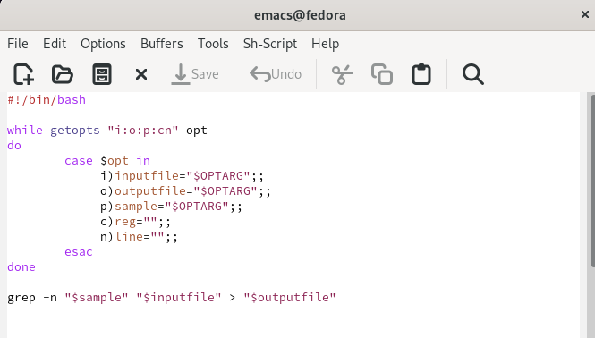{ #fig:001 width=70% }

---

## Ход работы

Запустил скрипт. (рис. [-@fig:002])

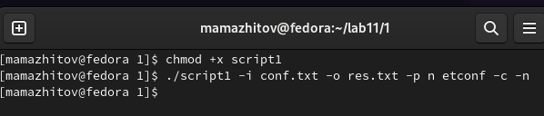{ #fig:002 width=70% }

---

## Ход работы

Проверка. (рис. [-@fig:003])

{ #fig:003 width=70% }

---

## Ход работы

Написал командный файл и программу на языке С++, которые получает на входе число и выводит больше, меньше или равно "0".(рис. [-@fig:004;-@fig:005])

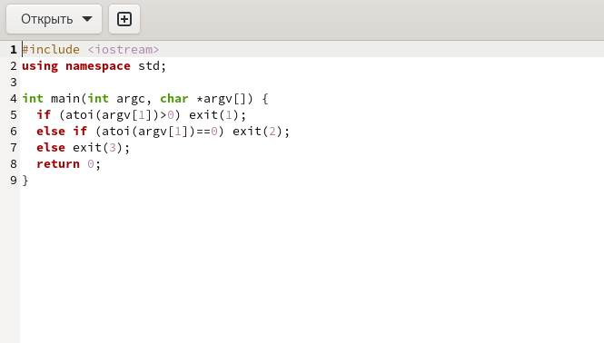{ #fig:004 width=70% }

---

## Ход работы

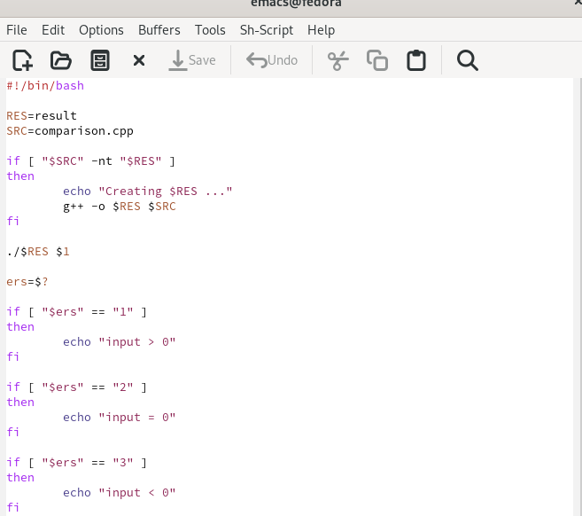{ #fig:005 width=70% }

---

## Ход работы

Запустил скрипт.(рис. [-@fig:006])

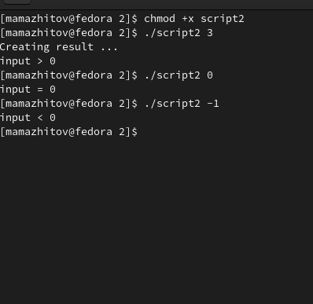{ #fig:006 width=70% }

---

## Ход работы

Открыл в emacs файл *script3* и написал программу, которая в зависимости от введенных опций либо создает определенное кол-во файлов, либо удаляет их.(рис. [-@fig:007])

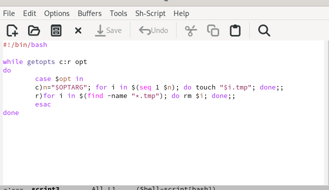{ #fig:007 width=70% }

---

## Ход работы

Запустил скрипт для создания файлов.(рис. [-@fig:008])

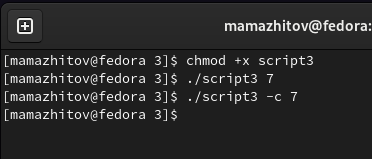{ #fig:008 width=70% }

---

## Ход работы

Результат.(рис. [-@fig:009])

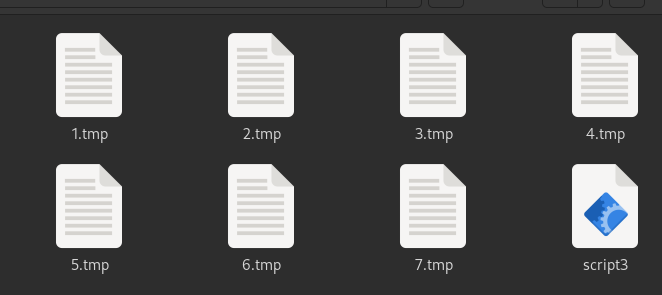{ #fig:009 width=70% }

---

## Ход работы

Запустил скрипт для удаления файлов.(рис. [-@fig:010])

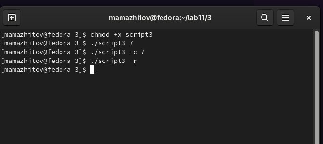{ #fig:010 width=70% }

---

## Ход работы

Результат.(рис. [-@fig:011])

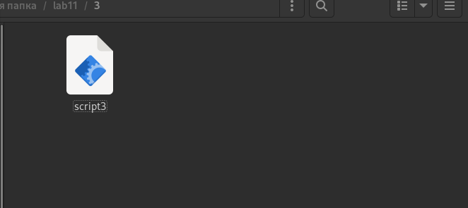{ #fig:011 width=70% }

---

## Ход работы

Открыл в emacs файл *script4*. Написал программу, которая с помощью команды tar запаковывает в архив все файлы в указанной директории. Модифицировал его так, чтобы запаковывались только те файлы, которые были изменены менее недели тому назад (рис. [-@fig:012])

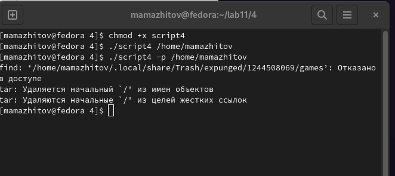{ #fig:012 width=70% }

---

## Ход работы

Проверил работу скрипта. (рис. [-@fig:013])

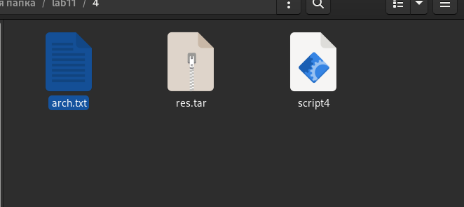{ #fig:013 width=70% }

---

## Ход работы

---

## Вывод

Мы научились писать более сложные командные файлы.