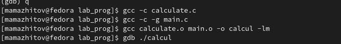
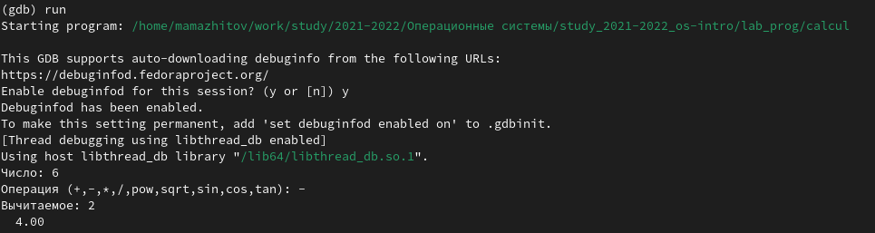
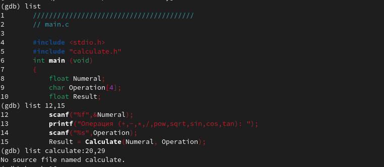
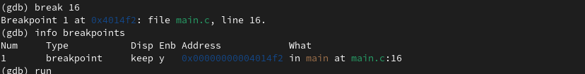
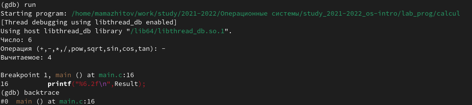
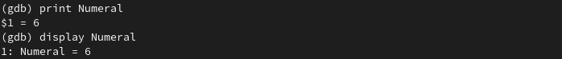
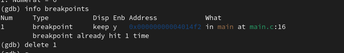
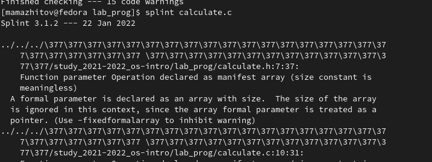

---
## Front matter
lang: ru-RU
title: Лабораторная работы №13 "Средства, применяемые при разработке программного обеспечения в ОС типа UNIX/Linux"
author: Тулеуов Мади
institute: RUDN University, Moscow, Russian Federation
date:

## Formatting
mainfont: PT Serif
romanfont: PT Serif
sansfont: PT Sans
monofont: PT Mono
toc: false
slide_level: 2
theme: metropolis
header-includes: 
 - \metroset{progressbar=frametitle,sectionpage=progressbar,numbering=fraction}
 - '\makeatletter'
 - '\beamer@ignorenonframefalse'
 - '\makeatother'
aspectratio: 43
section-titles: true
---

## Цель работы:

Приобрести простейшие навыки разработки, анализа, тестирования и отладки приложений в ОС типа UNIX/Linux на примере создания на языке программирования С калькулятора с простейшими функциями.

---

## Задачи

1. В домашнем каталоге создайте подкаталог ~/work/os/lab_prog.
2. Создайте в нём файлы: calculate.h, calculate.c, main.c. Это будет примитивнейший калькулятор, способный складывать, вычитать, умножать и делить, возводить число в степень, брать квадратный корень, вычислять sin, cos, tan. При запуске он будет запрашивать первое число, операцию, второе число. После этого программа выведет результат и остановится.

---

## Задачи

3. Выполнить компиляцию программы посредством gcc.
4. Создать Makefile.
5. С помощью gdb выполнить отладку программы calcul (перед использованием gdb исправьте Makefile):
- Запустить отладчик GDB, загрузив в него программу для отладки
- Для запуска программы внутри отладчика ввести команду run
- Для постраничного (по 9 строк) просмотра исходного код использовать команду list

---

## Задачи

- Для просмотра строк с 12 по 15 основного файла использовать list с параметрами
- Для просмотра определённых строк не основного файла использовать list с параметрами
- Установить точку останова
- Вывести информацию об имеющихся в проекте точка останова
- Запустить программу внутри отладчика и убедитесь, что программа остановится в момент прохождения точки останова
- Посмотреть, чему равно на этом этапе значение переменной Numeral
- Сравнить с результатом вывода на экран после использования команды *display Numeral*
- Убрать точки останова

---

## Ход работы

**1.** Создал в каталоге */home/mamazhitov/work/study/2021-2022/Операционные системы* подкаталог *lab_prog*. Создал в нем файлы *calculate.h, calculate.c, main.c*. Скопировал весь код этих файлов из лабораторки. Выполнил компиляцию этих файлов. (рис. [-@fig:001])

{ #fig:001 width=70% }

---

## Ход работы

**2.** С помощью gdb выполнил отладку, загрузив в него программу. Проверил работу калькулятора.(рис. [-@fig:002])

{ #fig:002 width=70% }

---

## Ход работы

**3.**  Вывел первые 9 строк файла main Затем вывел с 12 по 15 строки.(рис. [-@fig:003])

{ #fig:003 width=70% }

---

## Ход работы

**4.** Поставил точку остановы на 16 строке. Вывел информаци о точках остановы. (рис. [-@fig:004])

{ #fig:004 width=70% }

---

## Ход работы

**5.** Снова запустил программу. (рис. [-@fig:005])

{ #fig:005 width=70% }

---

## Ход работы

**6.** Вывел значения переменной Numeral различными командами. (рис. [-@fig:006])

{ #fig:006 width=70% }

---

## Ход работы

**7.** Удалил точку остановы. (рис. [-@fig:007])

{ #fig:007 width=70% }

---

## Ход работы

**8.** С помощью утилиты splint проанализировал коды файлов calculate.c и main.c. (рис. [-@fig:008])

{ #fig:008 width=70% }

---

## Вывод

Мы создали простейший калькулятор на языке С.