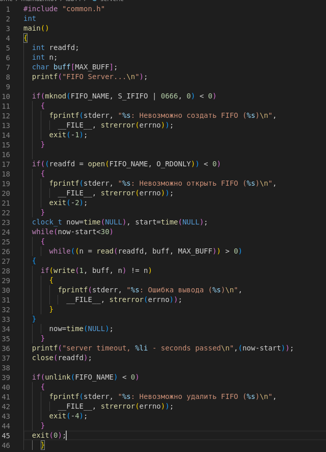
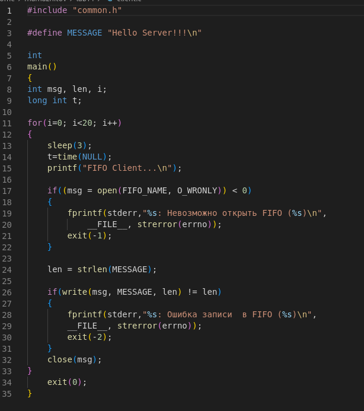

---
## Front matter
lang: ru-RU
title: Лабораторная работы №14 "Именованные каналы"
author: Тулеуов Мади
institute: RUDN University, Moscow, Russian Federation
date:

## Formatting
mainfont: PT Serif
romanfont: PT Serif
sansfont: PT Sans
monofont: PT Mono
toc: false
slide_level: 2
theme: metropolis
header-includes: 
 - \metroset{progressbar=frametitle,sectionpage=progressbar,numbering=fraction}
 - '\makeatletter'
 - '\beamer@ignorenonframefalse'
 - '\makeatother'
aspectratio: 43
section-titles: true
---

## Цель работы:

Приобретение практических навыков работы с именованными каналами.

---

## Задачи

Изучите приведённые в тексте программы server.c и client.c. Взяв данные примеры за образец, напишите аналогичные программы, внеся следующие изменения:

1. Работает не 1 клиент, а несколько (например, два).

2. Клиенты передают текущее время с некоторой периодичностью (например, раз в пять секунд). Используйте функцию sleep() для приостановки работы клиента.

3. Сервер работает не бесконечно, а прекращает работу через некоторое время (например, 30 сек). Используйте функцию clock() для определения времени работы сервера.
Что будет в случае, если сервер завершит работу, не закрыв канал?

---

## Ход работы

**1.** Создал файлы *common.h*, *server.c*, *client.c*, *client2.c*. Скопировал основной код из теоретической части лабораторной работы и немного подкорректировал его.(рис. [-@fig:001;-@fig:002;-@fig:003;-@fig:004])

{ #fig:001 width=70% }

---

## Ход работы

{ #fig:002 width=70% }

---

## Ход работы

{ #fig:003 width=70% }

---

## Ход работы

{ #fig:004 width=70% }

---

## Ход работы

**2.** Создал *makefile*.(рис. [-@fig:005])

{ #fig:005 width=70% }

---

## Ход работы

**3.**  Запустил *makefile*. Затем запустил *server*. (рис. [-@fig:006])

{ #fig:006 width=70% }

---

## Ход работы

**4.** Запустил client в отдельном окне терминала (рис. [-@fig:007])

{ #fig:007 width=70% }

---

## Вывод

Мы научились пользоваться именованными каналами.